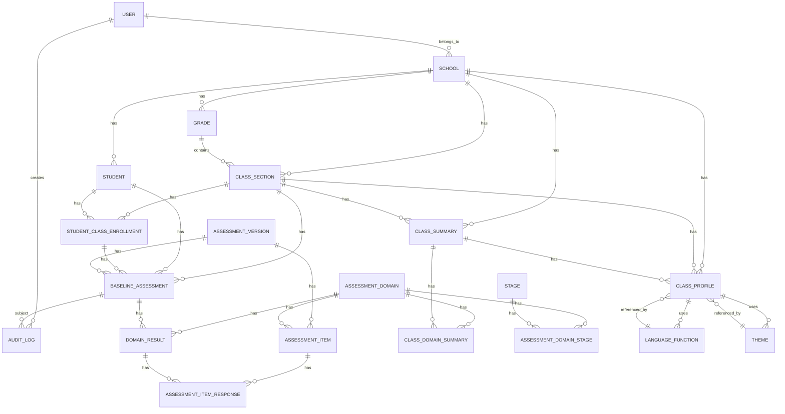

# LUMINO1 COMPLETE APPLICATION SPECIFICATION

**Document Version:** 1.0  
**Project:** Edspectrum Student Management System - LUMINO1 Assessment & Planning Module  
**Date:** September 2026  
**Status:** Architecture Review Ready  

---

## TABLE OF CONTENTS

1. Executive Summary
2. Confirmed Requirements
3. Assumptions & To Be Confirmed
4. Recommended Product Structure
5. User Roles & Permissions
6. Application Workflow
7. Page Architecture & Sitemap
8. Domain Model & Entity Design

---

## 1. EXECUTIVE SUMMARY

### 1.1 Product Overview

**LUMINO1** is a web-based student assessment and planning system designed for NGOs and schools managing multilingual learner development. It replaces fragmented Excel-based workflows with a unified, role-based platform for:

- **Baseline Assessment:** Capturing structured assessment data across 7 language domains
- **Class Analysis:** Automatic calculation of class-level domain distribution, dominant stages, and review flags
- **Classroom Profiling:** Bridging assessment data to instructional planning
- **Planning Integration:** Supporting Table 39 row-bundle selection and instructional themes

### 1.2 Core Problem Solved

**Before LUMINO1:**
- Multiple uncontrolled Excel files across schools
- No consistent data entry validation
- Manual, error-prone class-level calculations
- Difficulty tracking student growth month-by-month
- No school comparison capability
- Lack of individual student insights

**After LUMINO1:**
- Single source of truth for all student assessment data
- Automated, validated data entry
- Real-time class summaries and dominant stage analysis
- Month-by-month student growth tracking
- School-to-school comparison
- Clear identification of students/schools requiring priority support

### 1.3 MVP Scope

The MVP includes:

1. **Authentication & Authorization**
   - Role-based access control (Super Admin, School Admin, Assessor, HOD, Viewer)
   - School-level data isolation

2. **Master Data Management**
   - Schools, Grades, Classes/Sections
   - Student enrollment and class movement
   - Assessor/User management

3. **Baseline Assessment**
   - Assessment entry for 7 domains (Vocabulary, Grammar/Pattern, Phrase/Sentence, Listening, Speaking, Reading, Writing)
   - 5-item rating per domain (0–4 scale)
   - Support code tracking
   - Oral participation flags
   - Real-time stage calculation (Suggested Stage)
   - Teacher review and Final Stage override

4. **Class Summary**
   - Automatic stage distribution calculation (S1–S5)
   - Dominant stage identification
   - % Below Dominant calculation
   - Review flagging (>35% threshold)
   - Manually maintained Support/Anchor/Stretch bands
   - Planning implications

5. **Classroom Profile**
   - School/Class selection
   - Strong/Weak domain identification
   - Manual cross-domain pattern entry
   - Communication bottleneck documentation
   - Planning bridge fields
   - Classroom Profile Paragraph generation

6. **Reference Data Management**
   - Assessment domains
   - Stage definitions
   - Support codes
   - Oral participation flags
   - Language functions (dropdown)
   - Compatible themes (dropdown)
   - Framework families (placeholder for later definition)

### 1.4 Technology Stack

| Layer | Technology | Rationale |
|-------|-----------|-----------|
| Frontend | Angular 17+ | Enterprise-grade SPA framework |
| Language | TypeScript | Type safety, maintainability |
| UI Framework | Angular Material | Professional, accessible components |
| State | RxJS + Reactive Forms | Responsive, reactive data flows |
| Backend | NestJS | Modular, enterprise TypeScript backend |
| Database | PostgreSQL | Reliable, normalized, ACID-compliant |
| ORM | Prisma | Type-safe, excellent DX, migrations |
| API | REST + OpenAPI | Standard, well-documented |
| Authentication | JWT + OAuth2 | Stateless, scalable |
| Deployment | Docker + Kubernetes ready | Cloud-native architecture |

---

## 2. CONFIRMED REQUIREMENTS

### 2.1 Functional Requirements

#### FR-001: Authentication & Authorization
- Multi-role authentication (Super Admin, School Admin, Assessor, HOD, Viewer)
- JWT-based stateless authentication
- Role-based access control (RBAC)
- School-level data isolation
- Session management with timeout

#### FR-002: School Management
- CRUD operations for schools
- School-specific configuration
- Multi-school support with data isolation

#### FR-003: Class/Section Management
- Create classes within schools
- Manage class metadata (name, grade, section)
- View students enrolled in a class
- Track class status

#### FR-004: Student Management
- CRUD operations for students
- Student profile with demographics
- Class enrollment history
- Track assessment status per class
- Support for student movement between classes

#### FR-005: Baseline Assessment Entry
- Five-item rating interface for each domain (0–4 scale)
- Support code selection (Blank, R, P, WB, F, O, G, NR)
- Oral participation flag selection (C0–C3)
- Assessor name recording
- Assessment date tracking
- QC notes field
- Status field (Draft, In Review, Submitted, Reviewed)

#### FR-006: Assessment Calculation Engine
- Automatic Suggested Stage calculation based on rules
- Total score calculation (sum of 5 items)
- Review flag detection
- Missing data handling (all blank = all fields blank)
- Independent of UI (backend authoritative)

#### FR-007: Assessment Review & Override
- Teacher/HOD can review Suggested Stage
- Override to final stage
- Lock/unlock assessment for editing
- Audit trail of changes

#### FR-008: Class Summary Calculation
- Automatic aggregation of student stages by domain
- S1–S5 distribution counting
- Dominant stage identification (mode)
- % Below Dominant calculation with >35% review flag
- Filtering by Present students only

#### FR-009: Class Summary Display
- Tabular view of domains with S1–S5 distribution
- Review flags highlighted
- Manual Support/Anchor/Stretch band entry
- Manual planning implication entry
- Suggested framework family display (reference)

#### FR-010: Classroom Profile Creation
- Select school/class
- Display students assessed count
- Identify strong domains
- Identify weak domains
- Manual cross-domain pattern entry
- Manual communication bottleneck entry
- Select language function (dropdown)
- Select compatible theme (dropdown)
- Automatic classroom profile paragraph generation
- Planning readiness status

#### FR-011: Reference Data Management
- View/manage assessment domains
- View stage definitions
- View support code definitions
- View oral participation flag definitions
- Configure language functions
- Configure compatible themes
- View framework families

#### FR-012: User Management
- CRUD for users/assessors
- Role assignment
- School assignment
- Status management

#### FR-013: Audit Logging
- Log all assessment entries
- Log all overrides
- Log all profile/planning changes
- Timestamp and user tracking
- Viewable audit trail

#### FR-014: Reporting (MVP Basic)
- Student profile view
- Class summary export (CSV/PDF)
- Assessment history view

### 2.2 Assessment Business Rules

**7 Assessment Domains:**
- Vocabulary (V)
- Grammar/Pattern (G)
- Phrase/Sentence (P)
- Listening (L)
- Speaking (S)
- Reading (R)
- Writing (W)

**5-Item Rating Scale:** 0–4 per item

**Stage Progression Rule:**

```
S5  if R5 >= 3 AND R1, R2, R3, R4 all >= 2
S4  if R4 >= 3 AND R1, R2, R3 all >= 2
S3  if R3 >= 3 AND R1, R2 all >= 2
S2  if R2 >= 3 AND R1 >= 2
S1  if R1 >= 3
Otherwise: Review
```

**Total Score:** R1 + R2 + R3 + R4 + R5 (informational only, does NOT determine stage)

**Review Conditions:**
- R5 >= 3 and any of R1–R4 < 2
- R4 >= 3 and any of R1–R3 < 2
- R3 >= 3 and any of R1–R2 < 2
- R2 >= 3 and R1 < 2

**Final Stage Rules:**
- If Suggested Stage is blank or "Review": Final Stage = blank
- Otherwise: Final Stage initially = Suggested Stage
- Teacher may review and override

**Missing Data Rule:**
- If all 5 ratings are blank: Score, Suggested Stage, Review Flag, Final Stage all = blank

**Support Codes (do NOT indicate failure, only conditions):**
| Code | Meaning |
|------|---------|
| Blank | Independent/no major support |
| R | Repetition of prompt |
| P | Picture/object support |
| WB | Word bank |
| F | Frame/sentence starter |
| O | Options provided |
| G | Gesture/recognition only |
| NR | No valid response |

**Oral Participation Flags (Speaking confidence, NOT achievement):**
| Flag | Meaning |
|------|---------|
| C0 | Freezes/refuses/no attempt |
| C1 | Whispers/one-word only |
| C2 | Speaks after rehearsal/support |
| C3 | Independent/confident |

### 2.3 Class Summary Business Rules

**Filtering:**
- Select by School + Class/Section
- Include only Present students
- Include only students with assessed final stages

**Stage Distribution (S1–S5):**
- Count students at each stage per domain
- Total with Stage = S1 + S2 + S3 + S4 + S5

**Dominant Stage:**
- The stage with the highest student count
- NOT the average or median
- Example: S2=2, S3=5, S5=3 → Dominant = S3

**% Below Dominant:**
```
If Dominant = S1: 0%
If Dominant = S2: S1 / Total
If Dominant = S3: (S1 + S2) / Total
If Dominant = S4: (S1 + S2 + S3) / Total
If Dominant = S5: (S1 + S2 + S3 + S4) / Total
```

**Review Flag:**
- "OK" if % Below Dominant <= 35%
- "Review: >35% below dominant" if > 35%
- Boundary: 35% exactly = OK

**Support/Anchor/Stretch Bands:**
- Manually entered by HOD
- NOT automatically calculated
- Represent instructional focus areas

**Planning Implications:**
- Manually entered by HOD
- Should reflect domain patterns and review status
- NOT automatically generated

### 2.4 Classroom Profile Business Rules

**Template Paragraph:**
```
"In this class, learners show stronger readiness in ______ and ______. 
Most learners can ______. However, many learners need support in ______, 
especially ______. The main pattern is that students can ______, but they 
struggle to ______. This suggests that the class needs to move from ______ 
to ______."
```

**Fields:**
- School: dropdown (selected)
- Class/Section: dropdown (selected, filtered by school)
- Students assessed: calculated (count of assessed students)
- Assessment date: calculated (most recent)
- Strong domains: manual text
- Weak domains: manual text
- Cross-domain pattern: manual text (reference to 06_Cross_Domain_Guide)
- Communication bottleneck: manual text
- Provisional language direction: dropdown/text
- Possible central language function: dropdown
- Compatible theme: dropdown
- Immediate planning implication: manual text
- Ready for Table 39? dropdown (Yes/No/Not Yet)

**Readiness for Table 39:**
- "No" if required fields missing
- "Not Yet" if data incomplete
- "Yes" if all required planning fields complete

---

## 3. ASSUMPTIONS & TO BE CONFIRMED

### 3.1 To Be Confirmed (TBC)

These items are referenced but not yet defined in source documents:

#### Framework Names/Acronyms (TBC)
| Acronym | Status | Used By |
|---------|--------|---------|
| MEU | TBC | Vocabulary framework |
| Functional Phonics | TBC | Vocabulary framework |
| RRI | TBC | Cross-domain framework |
| NPU | TBC | Grammar/Pattern framework |
| FEC | TBC | Phrase/Sentence framework |
| 3L | TBC | Listening framework |
| PRSP | TBC | Speaking framework |
| PERC | TBC | Reading framework |
| LIT | TBC | Reading framework |
| IWDR | TBC | Writing framework |

**Action:** Confirm framework definitions and implementation with academic lead before Phase 7.

#### Reference Documents (TBC)
1. **06_Cross_Domain_Guide:** Referenced for manual cross-domain pattern entry
   - Currently not supplied
   - Contains patterns for identifying cross-domain supports
   - Should inform pattern selection interface

2. **Table 39 Row-Bundle Selection:** Referenced in classroom profile readiness
   - Currently not supplied
   - Contains row bundles for theme/function selection
   - Business rules for bundle eligibility unknown
   - Integration point with classroom profile

**Action:** Obtain and analyze these documents before Phase 6.

#### Acronyms (TBC)
| Acronym | Context | Status |
|---------|---------|--------|
| SAS | Class Summary field name | TBC (possibly Support/Anchor/Stretch) |

**Action:** Confirm acronym meanings with business stakeholder.

### 3.2 Assumptions

#### Assumption 1: Single Assessment Version
- **Assumption:** This MVP supports a single, current assessment version with 7 domains and 5 items per domain
- **Implication:** Future database design should accommodate multiple assessment versions
- **Recommendation:** Versioning structure planned but not implemented in MVP

#### Assumption 2: Assessment Ownership
- **Assumption:** One student + one class + one domain = one final stage result (no multiple assessments per domain per class)
- **Implication:** If reassessment is needed, the previous assessment is replaced or versioned
- **Recommendation:** Support historical versions but current assessment replaces prior

#### Assumption 3: Class Assignment Stability
- **Assumption:** A student remains in one class for the duration of an assessment cycle
- **Implication:** Class movement between cycles is supported; within-cycle movement is not
- **Recommendation:** Track class enrollment history with dates

#### Assumption 4: Teacher Override Authority
- **Assumption:** Only teachers/HOD can override Suggested Stage to Final Stage
- **Implication:** Super Admin/School Admin cannot override
- **Recommendation:** Implement RBAC with distinct override permissions

#### Assumption 5: Manual Planning Data
- **Assumption:** Support/Anchor/Stretch bands and Planning Implications are always manual
- **Implication:** No automated suggestions (system can highlight review flags)
- **Recommendation:** UX should clearly distinguish calculated vs. manual fields

#### Assumption 6: School Data Isolation
- **Assumption:** Users belong to one school; cannot see other schools' data
- **Implication:** Multi-school support requires role-based filtering at API level
- **Recommendation:** Implement school_id foreign key on all relevant entities

#### Assumption 7: Assessment Finality
- **Assumption:** Once an assessment is "Reviewed" status, it should not change
- **Implication:** Changes require unlock permission (admin override)
- **Recommendation:** Add locked_at timestamp and unlock_reason audit trail

#### Assumption 8: Student Presence Tracking
- **Assumption:** Class Summary filters by student Status = "Present"
- **Implication:** Absent/Excluded students are not counted
- **Recommendation:** Enrollment table includes status field

---

## 4. RECOMMENDED PRODUCT STRUCTURE

### 4.1 Core Principles

1. **Excel is Knowledge, Not Architecture**
   - Excel documents capture business logic
   - Database should be properly normalized
   - UI can mirror Excel layout for familiarity
   - Backend enforces all rules

2. **Calculation Always in Backend**
   - Frontend provides real-time feedback
   - Backend is authoritative
   - No duplicated calculation logic
   - Audit trail of calculated changes

3. **Manual vs. Calculated Clarity**
   - UI must distinguish automatic (calculated) from manual (entered) fields
   - Different styling/labeling
   - Clear "recalculate" actions

4. **Data Integrity First**
   - Database constraints enforce business rules
   - Not just application logic
   - Audit logging of all changes
   - Historical data never deleted

5. **Role-Based Everything**
   - Every page, field, action requires permission check
   - School-level isolation
   - Class-level for some workflows
   - Student-level for student-specific views

### 4.2 Logical Layers

```
┌─────────────────────────────────────────────────┐
│         Angular Frontend (Smart UI)              │
│  - Reactive forms with instant validation       │
│  - Real-time Suggested Stage preview            │
│  - Role-based component visibility              │
│  - Responsive, accessible Material Design       │
└─────────────────────────────────────────────────┘
                        ↕
┌─────────────────────────────────────────────────┐
│      NestJS API Layer (REST + OpenAPI)          │
│  - Authentication/Authorization                 │
│  - Input validation (DTOs)                      │
│  - Business rule enforcement                    │
│  - Audit logging middleware                     │
└─────────────────────────────────────────────────┘
                        ↕
┌─────────────────────────────────────────────────┐
│    Domain/Service Layer (Assessment Engine)     │
│  - Assessment calculation logic                 │
│  - Class summary aggregation                    │
│  - Planning bridge rules                        │
│  - Business logic, framework-agnostic           │
└─────────────────────────────────────────────────┘
                        ↕
┌─────────────────────────────────────────────────┐
│         Prisma ORM (Data Access)                │
│  - Type-safe query builder                      │
│  - Automatic migrations                         │
│  - Relationship loading                         │
└─────────────────────────────────────────────────┘
                        ↕
┌─────────────────────────────────────────────────┐
│      PostgreSQL Database (ACID Compliance)      │
│  - Normalized schema                            │
│  - Constraints, indexes                         │
│  - Audit logging tables                         │
│  - Historical data retention                    │
└─────────────────────────────────────────────────┘
```

### 4.3 Feature Modules

**Backend (NestJS):**

```
src/
├── auth/                    # JWT, OAuth2, login
├── users/                   # User CRUD, roles
├── schools/                 # School CRUD
├── classes/                 # Class/section CRUD
├── students/                # Student CRUD, enrollment
├── assessments/             # Assessment CRUD, entry
├── assessment-engine/       # Calculation logic (injectable service)
├── assessment-responses/    # Item ratings, support, oral flags
├── class-summary/           # Summary calculation, aggregation
├── class-profile/           # Profile CRUD, paragraph generation
├── planning/                # Planning bridge, Table 39 integration (Phase 6+)
├── reference-data/          # Domains, stages, codes (enums, configs)
├── audit/                   # Audit logging service
├── common/                  # Guards, interceptors, pipes, exceptions
├── config/                  # Environment config
└── prisma/                  # Database schema, migrations
```

**Frontend (Angular):**

```
src/
├── app/
│   ├── auth/                # Login, guards, interceptors
│   ├── core/                # Singleton services (API, auth)
│   ├── shared/              # Reusable components, pipes, directives
│   ├── layout/              # App shell, header, sidebar
│   ├── features/
│   │   ├── schools/         # School management module
│   │   ├── classes/         # Class management module
│   │   ├── students/        # Student management module
│   │   ├── assessments/     # Assessment entry & review module
│   │   ├── class-summary/   # Summary view module
│   │   ├── classroom-profile/ # Profile creation module
│   │   ├── reference-data/  # Configuration module (admin)
│   │   └── audit-log/       # Audit trail view (admin)
│   └── app-routing.module.ts
```

---

## 5. USER ROLES & PERMISSIONS

### 5.1 Recommended Role Hierarchy

#### Role 1: Super Admin
**Purpose:** System administration, global oversight

**Permissions:**
- View all schools
- Create/edit/delete schools
- View all classes in any school
- View all students in any school
- View all assessments (read-only)
- Manage all users and roles
- Configure reference data
- View audit logs
- Generate global reports
- Override any field (including locked assessments)

**Restrictions:**
- Cannot modify assessment data (only view)
- Cannot edit class profile/planning (view only)

---

#### Role 2: School Admin
**Purpose:** School-level management and oversight

**Permissions:**
- View own school only
- Manage classes within school
- View all students in own school
- View all assessments in own school (read-only)
- Manage users within own school
- Create/edit class summaries
- View audit logs for own school
- Generate school-level reports

**Restrictions:**
- Cannot override teacher entries
- Cannot delete submitted assessments
- Cannot modify student data (refer to Assessor)

---

#### Role 3: Assessor (Teacher/Evaluator)
**Purpose:** Student assessment and data entry

**Permissions:**
- View own school only
- View assigned classes
- View students in assigned classes
- Create/edit baseline assessments (own entries)
- Enter ratings, support codes, oral flags
- Submit assessments for review
- View assessment history for assigned students
- Create draft class profiles
- View class summaries (read-only)

**Restrictions:**
- Cannot delete assessments
- Cannot override own assessments
- Cannot edit planning implications
- Cannot manage users or reference data

---

#### Role 4: Head of Department (HOD)
**Purpose:** Instructional planning and review

**Permissions:**
- View own school only
- View assigned classes
- Review and approve assessments
- Override Suggested Stage to Final Stage
- Edit Support/Anchor/Stretch bands
- Edit planning implications
- Create/complete classroom profiles
- Access Table 39 planning tools
- View class summaries
- View detailed student profiles
- Approve readiness for next planning stage

**Restrictions:**
- Cannot enter raw assessment ratings (assessment entry)
- Cannot manage users
- Cannot delete data
- Cannot override other HODs' planning decisions (own domain only)

---

#### Role 5: Academic Coordinator (Optional, Phase 2+)
**Purpose:** Cross-school oversight and comparison

**Permissions:**
- View all schools (aggregate only)
- View all class summaries (read-only)
- Generate cross-school reports
- View audit logs
- Compare schools/classes by domain

**Restrictions:**
- Cannot modify any data
- Cannot access individual assessment details
- View-only role

---

#### Role 6: Viewer (Optional, Phase 2+)
**Purpose:** Limited reporting access

**Permissions:**
- View own school only
- View public reports
- View class-level summaries (no individual assessment details)

**Restrictions:**
- No creation, edit, or delete
- No assessment data access
- No planning data access

---

### 5.2 Permission Matrix

| Resource | Super Admin | School Admin | Assessor | HOD | Coordinator | Viewer |
|----------|:-:|:-:|:-:|:-:|:-:|:-:|
| **Schools** |
| View All | ✓ | ✓ (own) | ✗ | ✗ | ✓ | ✗ |
| Create/Edit/Delete | ✓ | ✗ | ✗ | ✗ | ✗ | ✗ |
| **Classes** |
| View | ✓ | ✓ (own school) | ✓ (assigned) | ✓ (assigned) | ✓ | ✓ |
| Create/Edit | ✓ | ✓ | ✗ | ✗ | ✗ | ✗ |
| Delete | ✓ | ✗ | ✗ | ✗ | ✗ | ✗ |
| **Students** |
| View | ✓ | ✓ (own school) | ✓ (assigned class) | ✓ (assigned class) | ✓ | ✓ (summary) |
| Create/Edit | ✓ | ✓ | ✗ | ✗ | ✗ | ✗ |
| **Assessments** |
| Create/Edit (Draft) | ✓ | ✗ | ✓ (own) | ✗ | ✗ | ✗ |
| Submit | ✓ (any) | ✗ | ✓ (own) | ✗ | ✗ | ✗ |
| Review/Override | ✓ | ✗ | ✗ | ✓ (own domain) | ✗ | ✗ |
| View | ✓ | ✓ (own school) | ✓ (own/assigned) | ✓ (assigned class) | ✓ (aggregate) | ✓ (summary) |
| Delete | ✓ | ✗ | ✗ | ✗ | ✗ | ✗ |
| **Class Summary** |
| View | ✓ | ✓ | ✓ (read) | ✓ (edit planning) | ✓ | ✓ |
| Edit Planning | ✓ | ✗ | ✗ | ✓ | ✗ | ✗ |
| **Class Profile** |
| Create/Edit | ✓ | ✗ | ✓ (draft) | ✓ (finalize) | ✗ | ✗ |
| View | ✓ | ✓ | ✓ | ✓ | ✓ | ✓ (summary) |
| **Users** |
| Manage | ✓ | ✓ (own school) | ✗ | ✗ | ✗ | ✗ |
| **Reference Data** |
| View | ✓ | ✓ | ✓ | ✓ | ✓ | ✓ |
| Edit | ✓ | ✗ | ✗ | ✗ | ✗ | ✗ |
| **Audit Logs** |
| View | ✓ | ✓ (own school) | ✓ (own entries) | ✓ (own overrides) | ✓ | ✗ |

---

## 6. APPLICATION WORKFLOW

### 6.1 High-Level User Journeys

#### Journey 1: Assess Students (Assessor)

```
1. Login (JWT Authentication)
   ↓
2. Dashboard (role: Assessor)
   - Display: "My Classes," "Recent Assessments," "Pending Review"
   ↓
3. Select School (pre-selected if single school)
   ↓
4. Select Class/Section
   ↓
5. View Students in Class
   - List: Student Name, Status, Last Assessed, Complete %
   - Filter: Present only
   ↓
6. Click "Assess Student" → Baseline Assessment Entry
   ↓
7. Enter/Edit Assessment
   - For each domain (7 domains):
     * Enter 5 item ratings (0–4)
     * System shows: Real-time Suggested Stage (calculated)
     * Select support code
     * Select oral flag (if Speaking domain)
   - Enter assessor name
   - Enter assessment date
   - Optional QC notes
   ↓
8. Save Draft
   - Validation: All ratings 0-4 or blank
   - Validation: Support code required if domain needs support
   ↓
9. Review Summary
   - Show calculated Suggested Stages
   - Show total scores (informational)
   - Show review flags
   ↓
10. Submit for Review
    - Status → "In Review"
    - Assessor cannot edit after submit
    ↓
11. Notification: HOD receives review notification
```

---

#### Journey 2: Review Assessment & Override (HOD)

```
1. Login (JWT Authentication)
   ↓
2. Dashboard (role: HOD)
   - Display: "Pending Reviews," "My Classes," "Class Summaries"
   ↓
3. Pending Reviews (assessments submitted)
   - List: Student, Class, Date Submitted, Status
   ↓
4. Click Assessment → Review Detail
   ↓
5. Review Assessment
   - Display: All ratings, calculated Suggested Stage, review flags
   - Display: Assessment history (previous assessments)
   ↓
6. Approve or Override
   - If Suggested Stage acceptable: Click "Approve"
     * Final Stage = Suggested Stage
     * Status → "Reviewed"
   - If override needed: Edit Final Stage dropdown
     * Select new stage (1–5) or blank
     * Reason field (required)
     * Status → "Reviewed (Overridden)"
   ↓
7. Save → Returns to Pending Reviews
   ↓
8. Notification: Assessor sees assessment reviewed
```

---

#### Journey 3: Create Class Summary (HOD)

```
1. Login
   ↓
2. Dashboard → "Class Summaries"
   ↓
3. Select School (pre-filtered to own)
   ↓
4. Select Class/Section
   ↓
5. System automatically generates:
   - Total Assessed (count)
   - S1–S5 distribution per domain
   - Dominant Stage per domain
   - % Below Dominant per domain
   - Review Flags (>35%)
   ↓
6. Review automated calculations
   - If >35% flagged: Review planned intervention
   ↓
7. Manual Planning Fields
   - Edit Support Band (text/dropdown)
   - Edit Anchor Band (text/dropdown)
   - Edit Stretch Band (text/dropdown)
   - Edit Planning Implication (narrative)
   ↓
8. Save → Class Summary complete
   ↓
9. Next: Create Class Profile
```

---

#### Journey 4: Create Classroom Profile (HOD)

```
1. From Class Summary, click "Create Profile"
   ↓
2. Select School/Class (auto-filled from summary)
   ↓
3. System displays:
   - Students Assessed (calculated)
   - Assessment Date (calculated)
   - Strong Domains (manual entry, can pre-populate from dominant stages)
   - Weak Domains (manual entry, can pre-populate from review flags)
   ↓
4. Manual Planning Fields
   - Cross-Domain Pattern (open text, reference to 06_Cross_Domain_Guide)
   - Communication Bottleneck (open text)
   - Provisional Language Direction (dropdown/text)
   ↓
5. Dropdown Selections
   - Possible Central Language Function (dropdown, TBC from Table 39)
   - Compatible Theme (dropdown, TBC from Table 39)
   ↓
6. System generates Classroom Profile Paragraph
   - HOD edits template blanks inline
   - Saves as narrative section
   ↓
7. Planning Implication (copy from class summary or edit)
   ↓
8. Readiness for Table 39
   - System auto-checks: required fields complete?
   - If Yes → "Ready"
   - If No → "Not Yet" with missing field list
   ↓
9. Save → Class Profile complete
   ↓
10. Next: Table 39 Planning (Phase 6+)
```

---

#### Journey 5: Dashboard & Reporting (All Roles)

```
1. Login → Role-based Dashboard
   ↓
2. Dashboard shows:
   
   ASSESSOR VIEW:
   - My Classes (assigned classes)
   - Recent Assessments (my entries)
   - Pending Reviews (awaiting HOD)
   - Class Summaries (read-only)
   
   HOD VIEW:
   - Pending Reviews (assigned classes)
   - My Class Summaries
   - Classes Ready for Profile
   - Classes with >35% Review Flags
   
   SCHOOL ADMIN VIEW:
   - School Overview (stats)
   - All Classes (summary)
   - Recent Activities
   - User Management
   
   SUPER ADMIN VIEW:
   - All Schools (overview)
   - System Statistics
   - User Management
   - Audit Log Access
   ↓
3. Click on item → Navigate to detail view
```

---

### 6.2 Core Workflow Timeline

```
MONTH 1: Baseline Assessment Setup
├─ Schools and classes created by admin
├─ Students enrolled
├─ Assessors assigned to classes
└─ Reference data configured

MONTH 2-3: Assessment Entry & Review
├─ Assessors enter baseline assessments
├─ System auto-calculates Suggested Stages
├─ HOD reviews and approves/overrides
└─ Assessment data locked

MONTH 4: Class Analysis & Profiling
├─ Class Summaries auto-generated
├─ HOD enters planning data
├─ Classroom Profiles created
└─ Ready for instructional planning

MONTH 5+: Instructional Delivery & Monitoring
├─ Teachers use profiles for planning
├─ Ongoing monitoring (next phase)
└─ Prepare for mid-year/end-year reassessment
```

---

## 7. PAGE ARCHITECTURE & SITEMAP

### 7.1 Application Sitemap

```
LUMINO1 Application
│
├── Auth Pages
│   ├── Login
│   └── Password Reset
│
├── Dashboard
│   ├── Role: Super Admin
│   ├── Role: School Admin
│   ├── Role: Assessor
│   ├── Role: HOD
│   └── Role: Coordinator
│
├── Master Data Management
│   ├── Schools
│   │   ├── List
│   │   ├── Create
│   │   └── Edit
│   ├── Classes/Sections
│   │   ├── List (by school)
│   │   ├── Create
│   │   └── Edit
│   └── Students
│       ├── List (by class or school)
│       ├── Create
│       ├── Edit
│       ├── Enrollment History
│       └── Profile
│
├── Assessment Module
│   ├── Baseline Assessment Entry
│   │   ├── By Student
│   │   ├── Bulk Entry (future)
│   │   └── Entry Form (7 domains)
│   ├── Assessment Review & Approval
│   │   ├── Pending Reviews (HOD)
│   │   ├── Suggested Stage Confirmation
│   │   └── Override Interface
│   ├── Assessment History
│   │   └── By Student
│   └── Assessment Status Dashboard
│       └── By Class
│
├── Class Analysis Module
│   ├── Class Summary
│   │   ├── Select School/Class
│   │   ├── View Auto-Calculated Distribution
│   │   │   ├── S1–S5 Counts
│   │   │   ├── Dominant Stage
│   │   │   ├── % Below Dominant
│   │   │   └── Review Flags
│   │   └── Edit Planning Fields
│   │       ├── Support/Anchor/Stretch Bands
│   │       └── Planning Implication
│   └── Classroom Profile
│       ├── Create Profile
│       ├── Edit Profile
│       │   ├── Strong/Weak Domains
│       │   ├── Cross-Domain Pattern
│       │   ├── Communication Bottleneck
│       │   ├── Language Function
│       │   ├── Theme Selection
│       │   └── Classroom Paragraph
│       ├── View Profile
│       └── Table 39 Readiness Check
│
├── Reference Data (Admin)
│   ├── Assessment Domains
│   ├── Stage Definitions
│   ├── Support Codes
│   ├── Oral Participation Flags
│   ├── Language Functions
│   ├── Compatible Themes
│   └── Framework Families
│
├── Planning Module (Phase 6+)
│   ├── Table 39 Integration
│   ├── Row-Bundle Selection
│   └── Instructional Theme Planning
│
├── User & Administration
│   ├── User Management
│   │   ├── List Users
│   │   ├── Create User
│   │   ├── Edit User Roles
│   │   └── Deactivate User
│   ├── School Configuration
│   │   ├── School Settings
│   │   └── User Assignments
│   └── System Configuration (Super Admin)
│       ├── Email/Notifications
│       ├── Assessment Versioning
│       └── Backup/Export
│
└── Reporting & Audit
    ├── Audit Logs
    │   ├── Assessment Changes
    │   ├── Profile Changes
    │   └── User Actions
    ├── Reports
    │   ├── Student Profile
    │   ├── Class Summary (CSV/PDF)
    │   ├── School Comparison
    │   └── Growth Tracking
    └── Data Export
        ├── Assessment Export
        ├── Class Summary Export
        └── Full Data Export (Admin)
```

### 7.2 Navigation Structure

**Main Navigation (Sidebar, responsive):**

```
LUMINO1
├─ Dashboard
├─ Master Data
│  ├─ Schools (admin)
│  ├─ Classes (admin/school admin)
│  └─ Students
├─ Assessments
│  ├─ Entry
│  ├─ Review (HOD)
│  └─ History
├─ Analysis
│  ├─ Class Summary
│  └─ Classroom Profile
├─ Reports
│  ├─ Student Profile
│  ├─ Class Summary
│  └─ School Comparison
├─ Administration (admin/super admin)
│  ├─ Users
│  ├─ Schools
│  ├─ Reference Data
│  └─ Audit Logs
└─ Help / Settings
   ├─ Documentation
   ├─ FAQ
   └─ Profile / Logout
```

---

## 8. DOMAIN MODEL & ENTITY DESIGN

### 8.1 Core Entities & Relationships

#### 8.1.1 User & Authentication

**Entity: User**

Purpose: System users with roles and school assignment

Fields:
- `id` (UUID, PK)
- `email` (string, unique)
- `password_hash` (string)
- `first_name` (string)
- `last_name` (string)
- `role` (enum: SUPER_ADMIN, SCHOOL_ADMIN, ASSESSOR, HOD, COORDINATOR, VIEWER)
- `school_id` (UUID, FK → School, nullable for SUPER_ADMIN)
- `status` (enum: ACTIVE, INACTIVE)
- `created_at` (timestamp)
- `updated_at` (timestamp)
- `created_by` (UUID, FK → User, audit)
- `password_reset_required` (boolean)
- `last_login_at` (timestamp, nullable)

Relationships:
- HasOne: School (SUPER_ADMIN has none)
- HasMany: AssignedClasses (for Assessor/HOD)
- HasMany: AuditLogs

Constraints:
- `email` unique
- `school_id` required except for SUPER_ADMIN
- `role` in allowed enum

---

#### 8.1.2 School & Organization

**Entity: School**

Purpose: Organization/school entity

Fields:
- `id` (UUID, PK)
- `name` (string)
- `code` (string, unique, shorthand for reports)
- `address` (string)
- `city` (string)
- `state` (string)
- `country` (string)
- `contact_email` (string)
- `contact_phone` (string)
- `ngo_id` (UUID, FK → NGO, nullable, future)
- `status` (enum: ACTIVE, INACTIVE)
- `created_at` (timestamp)
- `updated_at` (timestamp)
- `created_by` (UUID, FK → User)

Relationships:
- HasMany: Users
- HasMany: Grades
- HasMany: ClassSections
- HasMany: Students
- HasMany: Assessors (through User)
- HasMany: AuditLogs

Constraints:
- `name` unique per NGO
- `code` unique globally
- `status` enum

---

#### 8.1.3 Grade & Class Structure

**Entity: Grade**

Purpose: Grade/level within school

Fields:
- `id` (UUID, PK)
- `school_id` (UUID, FK → School)
- `number` (int, 1-12)
- `name` (string, e.g., "Class 8")
- `created_at` (timestamp)

Relationships:
- BelongsTo: School
- HasMany: ClassSections

Constraints:
- `school_id` + `number` unique
- `number` in range 1-12

---

**Entity: ClassSection**

Purpose: Class/section combination (e.g., "8A")

Fields:
- `id` (UUID, PK)
- `school_id` (UUID, FK → School)
- `grade_id` (UUID, FK → Grade)
- `section` (string, e.g., "A", "B")
- `name` (string, computed "Class 8A", for display)
- `status` (enum: ACTIVE, ARCHIVED)
- `assessment_cycle` (string, e.g., "2024-Q1", for grouping assessments)
- `created_at` (timestamp)
- `updated_at` (timestamp)
- `created_by` (UUID, FK → User)

Relationships:
- BelongsTo: School
- BelongsTo: Grade
- HasMany: StudentClassEnrollments
- HasMany: Assessments
- HasMany: ClassSummary
- HasMany: ClassProfile

Constraints:
- `school_id` + `grade_id` + `section` unique
- `status` enum

---

#### 8.1.4 Student & Enrollment

**Entity: Student**

Purpose: Individual learner

Fields:
- `id` (UUID, PK)
- `school_id` (UUID, FK → School)
- `student_id` (string, e.g., "STU-001", unique per school)
- `first_name` (string)
- `last_name` (string)
- `date_of_birth` (date, nullable)
- `gender` (enum: MALE, FEMALE, OTHER, PREFER_NOT_TO_SAY)
- `status` (enum: ACTIVE, INACTIVE, TRANSFERRED)
- `created_at` (timestamp)
- `updated_at` (timestamp)
- `created_by` (UUID, FK → User)

Relationships:
- BelongsTo: School
- HasMany: StudentClassEnrollments
- HasMany: Assessments

Constraints:
- `school_id` + `student_id` unique
- `status` enum

---

**Entity: StudentClassEnrollment**

Purpose: Track student class assignment over time

Fields:
- `id` (UUID, PK)
- `student_id` (UUID, FK → Student)
- `class_section_id` (UUID, FK → ClassSection)
- `school_id` (UUID, FK → School)
- `enrolled_date` (date)
- `withdrawn_date` (date, nullable)
- `status` (enum: PRESENT, ABSENT, TRANSFERRED, EXCLUDED)
- `is_current` (boolean, marks active enrollment)
- `created_at` (timestamp)

Relationships:
- BelongsTo: Student
- BelongsTo: ClassSection
- BelongsTo: School
- HasMany: Assessments

Constraints:
- `student_id` + `class_section_id` + `enrolled_date` unique
- `status` enum
- `withdrawn_date` >= `enrolled_date` if provided
- Only one `is_current` = true per student

---

### 8.2 Assessment Entities

**Entity: AssessmentDomain**

Purpose: Reference for 7 assessment domains (configuration)

Fields:
- `id` (UUID, PK)
- `code` (string, e.g., "V", "G", "P", "L", "S", "R", "W")
- `name` (string, e.g., "Vocabulary")
- `description` (text)
- `order` (int, 1-7, for display order)
- `created_at` (timestamp)

Relationships:
- HasMany: AssessmentItems
- HasMany: DomainResults

Constraints:
- `code` unique
- `order` unique in range 1-7

---

**Entity: AssessmentVersion**

Purpose: Track different assessment formats/versions

Fields:
- `id` (UUID, PK)
- `version_number` (string, e.g., "1.0", "1.1")
- `name` (string, e.g., "Lumino1 Baseline 2024")
- `description` (text)
- `is_current` (boolean, only one per version)
- `created_at` (timestamp)
- `created_by` (UUID, FK → User)

Relationships:
- HasMany: AssessmentItems

Constraints:
- `version_number` unique
- Only one `is_current` = true

---

**Entity: AssessmentItem**

Purpose: Individual rating within domain (5 items per domain, 35 total)

Fields:
- `id` (UUID, PK)
- `assessment_version_id` (UUID, FK → AssessmentVersion)
- `domain_id` (UUID, FK → AssessmentDomain)
- `item_number` (int, 1-5)
- `description` (string, e.g., "Item 1: Vocabulary Recognition")
- `created_at` (timestamp)

Relationships:
- BelongsTo: AssessmentVersion
- BelongsTo: AssessmentDomain
- HasMany: AssessmentItemResponses

Constraints:
- `assessment_version_id` + `domain_id` + `item_number` unique
- `item_number` in range 1-5

---

**Entity: Baseline Assessment**

Purpose: Assessment session for one student in one class

Fields:
- `id` (UUID, PK)
- `student_id` (UUID, FK → Student)
- `student_class_enrollment_id` (UUID, FK → StudentClassEnrollment)
- `school_id` (UUID, FK → School)
- `class_section_id` (UUID, FK → ClassSection)
- `assessment_version_id` (UUID, FK → AssessmentVersion)
- `assessment_date` (date)
- `assessor_id` (UUID, FK → User)
- `status` (enum: DRAFT, SUBMITTED, IN_REVIEW, REVIEWED, REVIEWED_OVERRIDE, LOCKED)
- `submission_date` (timestamp, nullable, when moved to IN_REVIEW)
- `review_date` (timestamp, nullable, when moved to REVIEWED)
- `locked_at` (timestamp, nullable, when locked for edit)
- `qc_notes` (text, optional)
- `created_at` (timestamp)
- `updated_at` (timestamp)
- `created_by` (UUID, FK → User)

Relationships:
- BelongsTo: Student
- BelongsTo: StudentClassEnrollment
- BelongsTo: School
- BelongsTo: ClassSection
- BelongsTo: AssessmentVersion
- BelongsTo: User (Assessor)
- HasMany: DomainResults
- HasMany: AuditLogs

Constraints:
- `student_id` + `class_section_id` + `assessment_version_id` unique (per assessment cycle)
- `status` enum
- `review_date` >= `submission_date` if provided
- `locked_at` set when status = LOCKED

---

**Entity: DomainResult**

Purpose: Results for one domain in one assessment

Fields:
- `id` (UUID, PK)
- `assessment_id` (UUID, FK → Baseline Assessment)
- `domain_id` (UUID, FK → AssessmentDomain)
- `total_score` (int, 0-20, sum of 5 items)
- `suggested_stage` (int, 1-5 or NULL, calculated)
- `review_needed` (boolean, calculated, true if Review conditions met)
- `final_stage` (int, 1-5 or NULL, teacher-reviewed)
- `final_stage_override` (boolean, true if different from suggested)
- `override_reason` (text, nullable, required if override=true)
- `reviewed_by` (UUID, FK → User, nullable, who set final stage)
- `reviewed_at` (timestamp, nullable)
- `support_code` (enum: BLANK, R, P, WB, F, O, G, NR, nullable)
- `oral_flag` (enum: C0, C1, C2, C3, nullable, only for Speaking domain)
- `created_at` (timestamp)
- `updated_at` (timestamp)

Relationships:
- BelongsTo: Assessment
- BelongsTo: Domain
- HasMany: AssessmentItemResponses

Constraints:
- `assessment_id` + `domain_id` unique
- `suggested_stage` in 1-5 or NULL
- `final_stage` in 1-5 or NULL
- If `final_stage_override` = true, `override_reason` required
- `total_score` in range 0-20
- `support_code` enum
- `oral_flag` enum

---

**Entity: AssessmentItemResponse**

Purpose: Individual rating for one item

Fields:
- `id` (UUID, PK)
- `domain_result_id` (UUID, FK → DomainResult)
- `assessment_item_id` (UUID, FK → AssessmentItem)
- `rating` (int, 0-4)
- `created_at` (timestamp)
- `updated_at` (timestamp)

Relationships:
- BelongsTo: DomainResult
- BelongsTo: AssessmentItem

Constraints:
- `domain_result_id` + `assessment_item_id` unique
- `rating` in range 0-4

---

### 8.3 Class Analysis Entities

**Entity: ClassSummary**

Purpose: Aggregate assessment results for a class

Fields:
- `id` (UUID, PK)
- `school_id` (UUID, FK → School)
- `class_section_id` (UUID, FK → ClassSection)
- `assessment_cycle` (string, e.g., "2024-Q1", groups assessments)
- `total_assessed` (int, calculated, count of students with assessments)
- `generated_at` (timestamp, when summary was calculated)
- `generated_by` (UUID, FK → User)
- `created_at` (timestamp)
- `updated_at` (timestamp)

Relationships:
- BelongsTo: School
- BelongsTo: ClassSection
- HasMany: ClassDomainSummary

Constraints:
- `school_id` + `class_section_id` + `assessment_cycle` unique
- `total_assessed` >= 0

---

**Entity: ClassDomainSummary**

Purpose: Domain-specific summary for a class

Fields:
- `id` (UUID, PK)
- `class_summary_id` (UUID, FK → ClassSummary)
- `domain_id` (UUID, FK → AssessmentDomain)
- `s1_count` (int, >= 0)
- `s2_count` (int, >= 0)
- `s3_count` (int, >= 0)
- `s4_count` (int, >= 0)
- `s5_count` (int, >= 0)
- `total_with_stage` (int, calculated, sum of S1-S5)
- `dominant_stage` (int, 1-5, most students)
- `percent_below_dominant` (decimal, 0-100)
- `review_flag` (enum: OK, REVIEW, NULL if no data)
- `support_band` (text, manual)
- `anchor_band` (text, manual)
- `stretch_band` (text, manual)
- `planning_implication` (text, manual)
- `framework_family` (string, e.g., "MEU / RRI", reference)
- `created_at` (timestamp)
- `updated_at` (timestamp)
- `updated_by` (UUID, FK → User, who edited planning fields)

Relationships:
- BelongsTo: ClassSummary
- BelongsTo: Domain

Constraints:
- `class_summary_id` + `domain_id` unique
- All _count fields >= 0
- `total_with_stage` = s1_count + s2_count + s3_count + s4_count + s5_count (calculated)
- `dominant_stage` in 1-5 or NULL
- `percent_below_dominant` in 0-100 or NULL
- `review_flag` enum

---

### 8.4 Planning Entities

**Entity: ClassProfile**

Purpose: Classroom profile and planning bridge

Fields:
- `id` (UUID, PK)
- `school_id` (UUID, FK → School)
- `class_section_id` (UUID, FK → ClassSection)
- `class_summary_id` (UUID, FK → ClassSummary, nullable, linked to specific summary)
- `students_assessed` (int, calculated from ClassSummary)
- `assessment_date` (date, calculated, most recent)
- `strong_domains` (text, manual)
- `weak_domains` (text, manual)
- `cross_domain_pattern` (text, manual, references 06_Cross_Domain_Guide)
- `communication_bottleneck` (text, manual)
- `provisional_language_direction` (text/enum, TBC)
- `central_language_function` (string, FK → LanguageFunction, TBC)
- `compatible_theme` (string, FK → Theme, TBC)
- `immediate_planning_implication` (text, manual)
- `classroom_profile_paragraph` (text, generated + manual edits)
- `ready_for_table39` (enum: NO, NOT_YET, YES)
- `table39_notes` (text, nullable)
- `created_at` (timestamp)
- `updated_at` (timestamp)
- `created_by` (UUID, FK → User)
- `updated_by` (UUID, FK → User)

Relationships:
- BelongsTo: School
- BelongsTo: ClassSection
- BelongsTo: ClassSummary
- BelongsTo: LanguageFunction (TBC)
- BelongsTo: Theme (TBC)
- HasMany: AuditLogs

Constraints:
- `school_id` + `class_section_id` unique
- `ready_for_table39` enum

---

**Entity: LanguageFunction** (TBC, Reference)

Purpose: Possible central language functions (from Table 39)

Fields:
- `id` (UUID, PK)
- `code` (string, unique)
- `name` (string)
- `description` (text)
- `created_at` (timestamp)

Relationships:
- HasMany: ClassProfiles

Constraints:
- `code` unique

Status: **To Be Confirmed** - awaiting Table 39 definition

---

**Entity: Theme** (TBC, Reference)

Purpose: Compatible themes for instruction

Fields:
- `id` (UUID, PK)
- `code` (string, unique)
- `name` (string)
- `description` (text)
- `created_at` (timestamp)

Relationships:
- HasMany: ClassProfiles

Constraints:
- `code` unique

Status: **To Be Confirmed** - awaiting Table 39 definition

---

### 8.5 Support Reference Entities

**Entity: Stage** (Reference)

Purpose: Achievement stage definitions

Fields:
- `id` (UUID, PK)
- `stage_number` (int, 1-5)
- `name` (string, e.g., "Emerging/Basic Recognition")
- `description` (text)
- `created_at` (timestamp)

Relationships:
- HasMany: AssessmentDomainStage

Constraints:
- `stage_number` unique in range 1-5

---

**Entity: AssessmentDomainStage** (Reference)

Purpose: Stage definition per domain (domain-specific descriptions)

Fields:
- `id` (UUID, PK)
- `domain_id` (UUID, FK → AssessmentDomain)
- `stage_id` (UUID, FK → Stage)
- `performance_description` (text)
- `created_at` (timestamp)

Relationships:
- BelongsTo: AssessmentDomain
- BelongsTo: Stage

Constraints:
- `domain_id` + `stage_id` unique

---

**Entity: SupportCode** (Reference/Enum)

Purpose: Support code definitions

Fields:
- `id` (UUID, PK)
- `code` (string, unique, e.g., "R", "P", "WB", "F", "O", "G", "NR")
- `meaning` (string, e.g., "Repetition")
- `description` (text)
- `created_at` (timestamp)

Relationships: N/A (reference only)

Constraints:
- `code` unique

---

**Entity: OralParticipationFlag** (Reference/Enum)

Purpose: Oral participation flag definitions

Fields:
- `id` (UUID, PK)
- `flag_code` (string, unique, e.g., "C0", "C1", "C2", "C3")
- `meaning` (string)
- `description` (text)
- `created_at` (timestamp)

Relationships: N/A (reference only)

Constraints:
- `flag_code` unique

---

### 8.6 Audit & Logging

**Entity: AuditLog**

Purpose: Track all system changes for compliance and debugging

Fields:
- `id` (UUID, PK)
- `user_id` (UUID, FK → User)
- `action` (enum: CREATE, UPDATE, DELETE, OVERRIDE, SUBMIT, REVIEW, LOCK, UNLOCK)
- `resource_type` (enum: ASSESSMENT, CLASS_SUMMARY, CLASS_PROFILE, STUDENT, CLASS, USER)
- `resource_id` (UUID, FK to respective resource)
- `old_values` (JSON, before change)
- `new_values` (JSON, after change)
- `reason` (text, nullable, e.g., override reason)
- `ip_address` (string, optional)
- `created_at` (timestamp)

Relationships:
- BelongsTo: User

Constraints:
- `action` enum
- `resource_type` enum

---

### 8.7 Entity Relationship Diagram (Mermaid)



---

## SUMMARY

This Part 1 covers:
- ✅ Executive Summary & Product Vision
- ✅ Confirmed Requirements (FR-001 through FR-014)
- ✅ Business Rules (Assessment, Class Summary, Classroom Profile)
- ✅ Assumptions & To Be Confirmed items
- ✅ User Roles & Permission Matrix
- ✅ Application Workflow & Journeys
- ✅ Page Architecture & Sitemap
- ✅ Complete Domain Model & Entity Design

**Next in Part 2:**
- Database Schema & ERD (SQL)
- Assessment Engine Design
- Class Summary Engine Design
- Backend Architecture (NestJS)
- Frontend Architecture (Angular)
- API Specification
- Security & Validation
- Testing Strategy
- Development Roadmap

---

**Document Prepared By:** Senior Software Architect  
**Status:** Ready for Technical Review  
**Next Steps:** Confirm outstanding items (TBC), obtain 06_Cross_Domain_Guide and Table 39, initiate Phase 1 development

