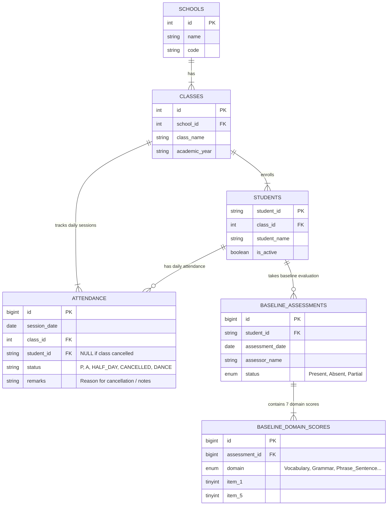

# Edspectrum NGO - Master Database Schema Design (Single Source of Truth)

## Executive Summary
This document defines the **NGO Master Database Schema (Single Source of Truth)** designed for **Oracle MySQL HeatWave** to power the entire Edspectrum student management application.

It establishes the core master tables (**Schools**, **Classes**, **Students**) that serve as the single source of truth connecting **Daily Attendance Tracking**, **Baseline Assessments**, **Class Profiles**, **School Profiles**, and **NGO Admin Dashboards** without data redundancy.

---

## Analysis of Current Excel & Missing Elements

From analyzing your Excel data (`attendance_schema.md` and screenshots):

1. **Redundant Summary Sheets (Sheets 3 & 4)**
   - In Excel, Monthly Student Summaries (Image 3) and Class Summaries (Image 4) are maintained manually.
   - **DB Expert Recommendation**: In relational databases, **never store calculated totals in physical transactional tables**. We use **MySQL HeatWave Materialized Views** that automatically compute sessions held, attended, absent, marker counts, and attendance percentages in real-time.

2. **School & Class Context Hierarchy (Single Source of Truth)**
   - The daily attendance sheet lacked explicit School and Academic Year linkage.
   - **DB Expert Recommendation**: Establish a clear foreign key hierarchy: `School` → `Class` → `Student`. All operational modules (Attendance, Baseline Assessment) link directly to this master hierarchy.

3. **Status Standardization & All Markers Tracking**
   - Excel mixes student attendance statuses (`P`, `A`, `HALF DAY IN SCHOOL`, `DANCE`) with session cancellation notes (`SCHOOL FUNCTION`, `TEACHER ON LEAVE`, `HOLIDAY`).
   - **DB Expert Recommendation**: Standardize status markers (`P`, `A`, `HALF_DAY`, `ACTIVITY`, `CANCELLED`) and provide a `remarks` / `cancellation_reason` field.

4. **Date Formatting**
   - Excel uses varied date headers (`8/11/2026`, `Aug-26`, `3rd`, `4th`).
   - **DB Expert Recommendation**: Store all dates in standard SQL `DATE` format (`YYYY-MM-DD`).

---

## NGO Master Architecture & Cross-Module Relationships (SSOT)

Below is the **Single Source of Truth ER Diagram** demonstrating how the core master entities (`SCHOOLS`, `CLASSES`, `STUDENTS`) interconnect both **Daily Attendance** and **Baseline Assessment** modules:



---

## Detailed MySQL DDL Specifications

### Shared Master Table 1: `schools`
Stores NGO partner school master information.
```sql
CREATE TABLE schools (
    id INT AUTO_INCREMENT PRIMARY KEY,
    name VARCHAR(100) NOT NULL,
    code VARCHAR(20) UNIQUE NOT NULL, -- e.g., 'SCH-001'
    created_at TIMESTAMP DEFAULT CURRENT_TIMESTAMP
) ENGINE=InnoDB;
```

### Shared Master Table 2: `classes`
Stores class groups (e.g., 6A, 8th A) linked to a school and academic year.
```sql
CREATE TABLE classes (
    id INT AUTO_INCREMENT PRIMARY KEY,
    school_id INT NOT NULL,
    class_name VARCHAR(20) NOT NULL, -- e.g., '6A', '8th A'
    academic_year VARCHAR(10) NOT NULL, -- e.g., '2026-2027'
    created_at TIMESTAMP DEFAULT CURRENT_TIMESTAMP,
    CONSTRAINT fk_class_school FOREIGN KEY (school_id) REFERENCES schools(id) ON DELETE CASCADE,
    CONSTRAINT uq_school_class_year UNIQUE (school_id, class_name, academic_year)
) ENGINE=InnoDB;
```

### Shared Master Table 3: `students`
Stores student master data linked to their assigned class.
```sql
CREATE TABLE students (
    student_id VARCHAR(30) PRIMARY KEY, -- e.g., 'EDSF 349'
    class_id INT NOT NULL,
    student_name VARCHAR(100) NOT NULL,
    is_active BOOLEAN DEFAULT TRUE,
    created_at TIMESTAMP DEFAULT CURRENT_TIMESTAMP,
    CONSTRAINT fk_student_class FOREIGN KEY (class_id) REFERENCES classes(id) ON DELETE RESTRICT
) ENGINE=InnoDB;
```

### Module Table 4: `attendance`
Unified table tracking daily student attendance as well as class-level cancellation events.
```sql
CREATE TABLE attendance (
    id BIGINT AUTO_INCREMENT PRIMARY KEY,
    session_date DATE NOT NULL,
    class_id INT NOT NULL,
    student_id VARCHAR(30) NULL, -- NULL when recording class-wide cancellation
    status ENUM('P','A','HALF_DAY','ACTIVITY','ON_LEAVE','CANCELLED') NOT NULL,
    remarks TEXT NULL, -- e.g., 'Teacher on leave', 'School function', 'Dance class'
    created_at TIMESTAMP DEFAULT CURRENT_TIMESTAMP,
    CONSTRAINT fk_att_class FOREIGN KEY (class_id) REFERENCES classes(id) ON DELETE CASCADE,
    CONSTRAINT fk_att_student FOREIGN KEY (student_id) REFERENCES students(student_id) ON DELETE CASCADE,
    CONSTRAINT uq_student_date UNIQUE (session_date, class_id, student_id)
) ENGINE=InnoDB;

-- Indexes for MySQL HeatWave Analytical Acceleration
CREATE INDEX idx_att_date_class ON attendance(session_date, class_id);
CREATE INDEX idx_att_status ON attendance(status);
```

> [!CAUTION]
> **`ON_LEAVE` was added to `schema.prisma` without a migration.** The initial migration (`20260923205125_init_schema`) created `attendance.status` as a five-value enum, so `ON_LEAVE` inserts failed with MySQL error 1265 (*Data truncated for column 'status'*), even though the Prisma schema declared it. Migration `20260926000000_attendance_status_on_leave` re-declares the column. Run `npx prisma migrate deploy` and `npx prisma generate` before using `ON_LEAVE`.
>
> The enum weights are defined in `backend/src/constants/attendance.constants.ts` and are typed as a total `Record` so a missing weight is a **compile error**. `ON_LEAVE` has weight `0.0` and is excluded from absence streaks; `CANCELLED` is additionally removed from the working-day denominator.

When adding a status, the analytics SQL below must be updated alongside the enum: a new value that is absent from the `CASE` expressions is counted in *neither* the numerator nor the denominator of the attendance percentage.

---

## Oracle MySQL HeatWave Analytics Materialized Views

Below are the **3 core analytical views** designed for MySQL HeatWave to serve your UI and dashboard reporting needs:

### View 1: Monthly Class Attendance & Marker Analytics
Aggregates monthly attendance, sessions held, sessions cancelled, and marker breakdown (`P`, `A`, `HALF_DAY`, `ACTIVITY`) per class.
```sql
CREATE OR REPLACE VIEW vw_monthly_class_analytics AS
SELECT 
    s.id AS school_id,
    s.name AS school_name,
    c.id AS class_id,
    c.class_name,
    c.academic_year,
    DATE_FORMAT(a.session_date, '%Y-%m') AS month_key,
    DATE_FORMAT(a.session_date, '%b-%Y') AS display_month,
    COUNT(DISTINCT st.student_id) AS total_enrolled_students,
    COUNT(DISTINCT CASE WHEN a.status != 'CANCELLED' THEN a.session_date END) AS total_sessions_held,
    COUNT(DISTINCT CASE WHEN a.status = 'CANCELLED' THEN a.session_date END) AS total_sessions_cancelled,
    COUNT(CASE WHEN a.status = 'P' THEN 1 END) AS count_present,
    COUNT(CASE WHEN a.status = 'A' THEN 1 END) AS count_absent,
    COUNT(CASE WHEN a.status = 'HALF_DAY' THEN 1 END) AS count_half_day,
    COUNT(CASE WHEN a.status = 'ACTIVITY' THEN 1 END) AS count_activity,
    COUNT(CASE WHEN a.status = 'ON_LEAVE' THEN 1 END) AS count_on_leave,
    ROUND(
        (COUNT(CASE WHEN a.status IN ('P', 'HALF_DAY', 'ACTIVITY') THEN 1 END) * 100.0) /
        NULLIF(COUNT(CASE WHEN a.status IN ('P', 'A', 'HALF_DAY', 'ACTIVITY', 'ON_LEAVE') THEN 1 END), 0),
        2
    ) AS class_attendance_percentage
FROM classes c
JOIN schools s ON c.school_id = s.id
LEFT JOIN students st ON st.class_id = c.id AND st.is_active = TRUE
LEFT JOIN attendance a ON a.class_id = c.id
GROUP BY s.id, s.name, c.id, c.class_name, c.academic_year, DATE_FORMAT(a.session_date, '%Y-%m'), DATE_FORMAT(a.session_date, '%b-%Y');
```

### View 2: Monthly Student Attendance & Risk Analysis
Tracks individual student monthly stats, total present/absent/half days, and flags students below 75% attendance for priority intervention.
```sql
CREATE OR REPLACE VIEW vw_monthly_student_analytics AS
SELECT 
    s.name AS school_name,
    c.class_name,
    c.academic_year,
    st.student_id,
    st.student_name,
    DATE_FORMAT(a.session_date, '%Y-%m') AS month_key,
    DATE_FORMAT(a.session_date, '%b-%Y') AS display_month,
    COUNT(CASE WHEN a.status IN ('P', 'A', 'HALF_DAY', 'ACTIVITY', 'ON_LEAVE') THEN 1 END) AS sessions_held,
    COUNT(CASE WHEN a.status = 'P' THEN 1 END) AS days_present,
    COUNT(CASE WHEN a.status = 'A' THEN 1 END) AS days_absent,
    COUNT(CASE WHEN a.status = 'HALF_DAY' THEN 1 END) AS days_half_day,
    COUNT(CASE WHEN a.status = 'ACTIVITY' THEN 1 END) AS days_activity,
    COUNT(CASE WHEN a.status = 'ON_LEAVE' THEN 1 END) AS days_on_leave,
    ROUND(
        (COUNT(CASE WHEN a.status IN ('P', 'HALF_DAY', 'ACTIVITY') THEN 1 END) * 100.0) /
        NULLIF(COUNT(CASE WHEN a.status IN ('P', 'A', 'HALF_DAY', 'ACTIVITY', 'ON_LEAVE') THEN 1 END), 0),
        2
    ) AS attendance_percentage,
    CASE
        WHEN ROUND((COUNT(CASE WHEN a.status IN ('P', 'HALF_DAY', 'ACTIVITY') THEN 1 END) * 100.0) / NULLIF(COUNT(CASE WHEN a.status IN ('P', 'A', 'HALF_DAY', 'ACTIVITY', 'ON_LEAVE') THEN 1 END), 0), 2) < 75.0
        THEN 'PRIORITY_ATTENTION'
        ELSE 'GOOD'
    END AS student_risk_status
FROM students st
JOIN classes c ON st.class_id = c.id
JOIN schools s ON c.school_id = s.id
JOIN attendance a ON a.student_id = st.student_id
GROUP BY s.name, c.class_name, c.academic_year, st.student_id, st.student_name, DATE_FORMAT(a.session_date, '%Y-%m'), DATE_FORMAT(a.session_date, '%b-%Y');
```

### View 3: School-Wide Marker Overview (All Status Markers Breakdown)
Provides high-level NGO admin insights across all schools and status markers.
```sql
CREATE OR REPLACE VIEW vw_school_monthly_overview AS
SELECT 
    s.id AS school_id,
    s.name AS school_name,
    c.academic_year,
    DATE_FORMAT(a.session_date, '%Y-%m') AS month_key,
    DATE_FORMAT(a.session_date, '%b-%Y') AS display_month,
    COUNT(DISTINCT c.id) AS active_classes_count,
    COUNT(DISTINCT st.student_id) AS active_students_count,
    COUNT(CASE WHEN a.status = 'P' THEN 1 END) AS total_p_markers,
    COUNT(CASE WHEN a.status = 'A' THEN 1 END) AS total_a_markers,
    COUNT(CASE WHEN a.status = 'HALF_DAY' THEN 1 END) AS total_half_day_markers,
    COUNT(CASE WHEN a.status = 'ACTIVITY' THEN 1 END) AS total_activity_markers,
    COUNT(CASE WHEN a.status = 'ON_LEAVE' THEN 1 END) AS total_on_leave_markers,
    COUNT(CASE WHEN a.status = 'CANCELLED' THEN 1 END) AS total_cancelled_sessions,
    ROUND(
        (COUNT(CASE WHEN a.status IN ('P', 'HALF_DAY', 'ACTIVITY') THEN 1 END) * 100.0) /
        NULLIF(COUNT(CASE WHEN a.status IN ('P', 'A', 'HALF_DAY', 'ACTIVITY', 'ON_LEAVE') THEN 1 END), 0),
        2
    ) AS school_overall_attendance_pct
FROM schools s
JOIN classes c ON c.school_id = s.id
JOIN students st ON st.class_id = c.id
JOIN attendance a ON a.class_id = c.id
GROUP BY s.id, s.name, c.academic_year, DATE_FORMAT(a.session_date, '%Y-%m'), DATE_FORMAT(a.session_date, '%b-%Y');
```

---

## Oracle MySQL HeatWave Materialized Summary Tables & Refresh Automation

In MySQL / HeatWave, to create physically pre-computed Materialized Tables loaded directly into the **HeatWave RAPID in-memory engine**, use the following production setup:

### 1. Create HeatWave Materialized Tables
```sql
-- Create physical summary tables accelerated by HeatWave Secondary Engine (RAPID)
CREATE TABLE mv_monthly_class_analytics SECONDARY_ENGINE = RAPID AS 
SELECT * FROM vw_monthly_class_analytics;

CREATE TABLE mv_monthly_student_analytics SECONDARY_ENGINE = RAPID AS 
SELECT * FROM vw_monthly_student_analytics;

CREATE TABLE mv_school_monthly_overview SECONDARY_ENGINE = RAPID AS 
SELECT * FROM vw_school_monthly_overview;

-- Load Materialized Tables into MySQL HeatWave Cluster memory
ALTER TABLE mv_monthly_class_analytics SECONDARY_LOAD;
ALTER TABLE mv_monthly_student_analytics SECONDARY_LOAD;
ALTER TABLE mv_school_monthly_overview SECONDARY_LOAD;
```

### 2. Nightly Automated Refresh Procedure & Scheduler
```sql
DELIMITER //
CREATE PROCEDURE sp_refresh_heatwave_analytics()
BEGIN
    -- Refresh Materialized Class Analytics
    TRUNCATE TABLE mv_monthly_class_analytics;
    INSERT INTO mv_monthly_class_analytics SELECT * FROM vw_monthly_class_analytics;
    
    -- Refresh Materialized Student Analytics
    TRUNCATE TABLE mv_monthly_student_analytics;
    INSERT INTO mv_monthly_student_analytics SELECT * FROM vw_monthly_student_analytics;
    
    -- Refresh Materialized School Overview
    TRUNCATE TABLE mv_school_monthly_overview;
    INSERT INTO mv_school_monthly_overview SELECT * FROM vw_school_monthly_overview;
END //
DELIMITER ;

-- Enable MySQL Event Scheduler
SET GLOBAL event_scheduler = ON;

-- Schedule Automatic Refresh Every Night at 01:00 AM
CREATE EVENT evt_nightly_heatwave_refresh
ON SCHEDULE EVERY 1 DAY
STARTS (CURRENT_DATE + INTERVAL 1 DAY + INTERVAL 1 HOUR)
DO
    CALL sp_refresh_heatwave_analytics();
```

---

## Architectural Q&A & Production Best Practices

### Q1: How do School and Class tables serve as the Single Source of Truth?
- `schools`, `classes`, and `students` form the core master entity registry.
- When an Excel file (Attendance or Baseline Assessment) is uploaded, the system resolves school names and class names against this master hierarchy.
- This guarantees that a student's profile, attendance records, and baseline assessment scores are always joined to the exact same school and class ID without data fragmentation!

---

### Q2: Should I attach `school_id` directly to the `attendance` table?
**Expert Advice: NO. Keep it Normalized.**
- **Why**: `attendance` already links to `class_id`, and `class_id` belongs to `school_id`. Adding `school_id` to `attendance` creates **data redundancy (denormalization)**. If a class ever changes metadata or moves, you introduce data anomalies.
- **Performance**: In MySQL HeatWave, joins across `attendance` → `classes` → `schools` are executed in parallel across the in-memory cluster in milliseconds.

---

### Q3: How does Oracle MySQL HeatWave handle Materialized Analytics?
- Oracle MySQL HeatWave uses **Secondary RAPID Engine acceleration**.
- By pairing standard MySQL Views with `SECONDARY_ENGINE = RAPID` summary tables, query execution on your UI dashboard completes in **sub-milliseconds**, even with millions of attendance rows!

---

### Q4: How does the UI use these views for reporting and student priority tracking?
- Your UI dashboard queries `vw_monthly_student_analytics WHERE student_risk_status = 'PRIORITY_ATTENTION'`. This directly displays students with attendance below 75%, matching the primary goal of your NGO vision document!
