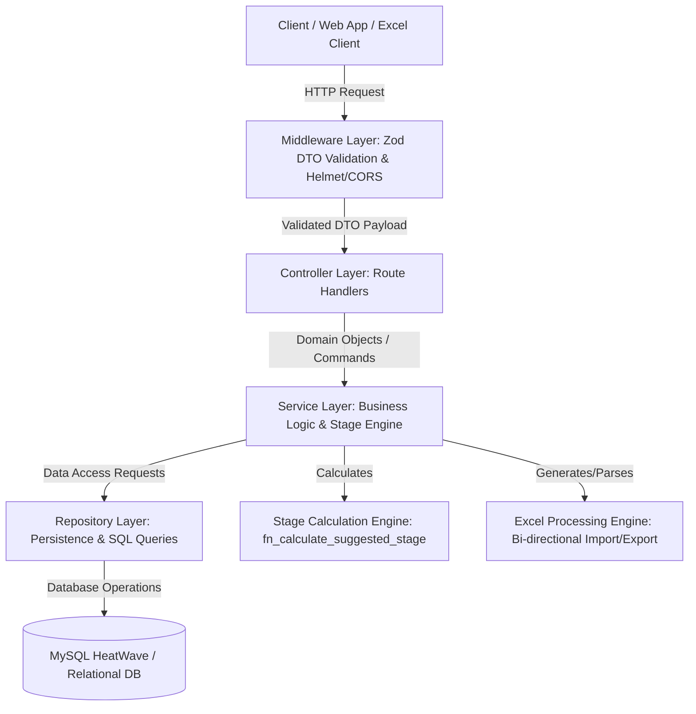

# Lumino1 Baseline Assessment - System Architecture Specification

## 1. High-Level Structural Layout
The backend application follows a strict **Clean Layered Architecture** (Controller -> Service -> Repository / Data Access Layer) to ensure complete decoupling, strict static typing, modularity, and testability.



## 2. Directory & Module Boundaries
```
backend/
├── docs/
│   └── backend/
│       ├── architecture.md    # System structural layout and workflow diagrams
│       ├── configuration.md   # Deployment, environment variables, validation rules
│       └── tracking.md        # API routes registry, endpoints, and future scopes 
├── src/
│   ├── config/          # Environment variables, database pools, logging instances
│   ├── constants/       # HTTP status codes, reusable message tokens, domain enums
│   ├── controllers/     # Route handlers (Request parsing, status responses, delegating to services)
│   ├── dtos/            # Zod validation schemas and structural interface definitions
│   ├── middlewares/     # Error handlers, rate limiters, validation runners
│   ├── repositories/    # Direct database interface logic / abstraction layer
│   ├── routes/          # Express route registration mappings
│   ├── services/        # Business logic domain, transactional boundaries, stage calculations
│   ├── utils/           # Helper scripts (AppError class, formatters, stage calculator)
├─── metrics/             # Akshara dashboard module (read-only, GET-only)
├─── │   ├─── constants/  # Threshold tables, M&E bands, SAS & stage vocabulary
├─── │   ├─── models/     # Narrow read-model contracts (NOT Prisma models)
├─── │   ├─── dtos/       # Request filters + one response DTO per dashboard aspect
├─── │   ├─── repositories/ # Read-only Prisma projections for the metrics-owned tables
├─── │   ├─── services/   # MetricsService (orchestration) + 2 pure calculators
├─── │   ├─── utils/      # MetricsCalculationUtils: percentage, deltas, Gini, risk score
├─── │   └─── controllers/ # MetricsController (TSOA) -> /metrics/... (+ /api/v1/metrics alias)
    ├─── parentInteraction/   # Parent Interaction register (READ + WRITE)
    ├─── │   ├─── constants/  # mode / status / relation vocabularies + spreadsheet alias tables
    ├─── │   ├─── dtos/       # Zod upload + filter schemas, request/response contracts
    ├─── │   ├─── repositories/ # Bulk insert (createMany) + filter bag -> Prisma `where`
    ├─── │   ├─── services/   # Input formatting: date/visitNo coercion, row-level errors
    ├─── │   └─── controllers/ # ParentInteractionController (TSOA) -> /parent-interactions/... (+ /api alias)
│   └── index.ts         # Application entry point, server runtime listener
```

## 3. Data Processing & Calculation Pipeline
1. **Request Validation**: Zod middleware validates request headers, params, and body structure prior to controller invocation.
2. **Controller Layer**: Parses path/query parameters, calls appropriate service methods, and maps responses to standard JSON format.
3. **Service Layer**:
   - Executes domain business logic.
   - Computes suggested stage ratings (`S1`-`S5`, `Review`, `AB`) across all 7 domains (Vocabulary, Grammar, Phrase/Sentence, Listening, Speaking, Reading, Writing) using individual item ratings (0-4).
   - Manages bi-directional Excel translation.
4. **Repository Layer**: Handles persistence logic against `baseline_assessments` (Header) and `baseline_domain_scores` (Detail scores) tables.

### Metrics Module Boundary Rules

The `metrics/` package follows the same Controller -> Service -> Repository layering, with two additional constraints:

1. **Purity boundary.** `utils/MetricsCalculationUtils.ts`, `DomainMetricsCalculator.service.ts` and `KPIMetricsCalculator.service.ts` perform **no I/O** and hold no state. Only `metrics.service.ts` and `metrics.repository.ts` touch Prisma. This keeps the entire calculation surface unit-testable with plain object fixtures.
2. **Reuse over duplication.** The module imports `ATTENDANCE_PRESENT_WEIGHT` from `constants/attendance.constants.ts` instead of re-deriving attendance weights, and reads `finalStage ?? suggestedStage` with the same precedence the class summary uses. A new attendance status or a change to the override rule is therefore honoured in one place only.
2. **Reuse over duplication.** The module imports `ATTENDANCE_PRESENT_WEIGHT` from `constants/attendance.constants.ts` instead of re-deriving attendance weights, and reads `finalStage ?? suggestedStage` with the same precedence the class summary uses. A new attendance status or a change to the override rule is therefore honoured in one place only.

### Parent Interaction Register - Database Schema Changes

Migration `20260930090000_parent_interactions` is **additive only**: it creates the single table `parent_interactions` and alters no existing table, column, index or enum, so it is safe to apply to a database already carrying live programme data.

The table is **deliberately denormalised** - it is a historical register, not a live view of the student record:

| Column | Type | Null | Notes |
| :--- | :--- | :--- | :--- |
| `id` | `INTEGER` PK AUTO_INCREMENT | no | |
| `student_id` | `VARCHAR(100)` | no | Student **code** (`Student.studentIdCode`), **not** `students.id` |
| `student_name` | `VARCHAR(200)` | no | Text snapshot - a later rename must not rewrite history |
| `class` | `VARCHAR(100)` | no | Text snapshot |
| `parent_name` | `VARCHAR(150)` | no | |
| `relation` | `VARCHAR(50)` | yes | Normalised to `PARENT_RELATIONS` |
| `date` | `DATE` | no | Interaction date; `@db.Date` so no time-of-day skew |
| `mode` | `VARCHAR(50)` | yes | Normalised to `PARENT_INTERACTION_MODES` |
| `visit_no` | `INTEGER` | yes | Running number entered by the user, not a DB sequence |
| `purpose` / `parent_shared` / `key_notes` / `observation` / `commitment` / `objective` | `TEXT` | yes | Narrative columns |
| `next_date` | `DATE` | yes | Drives the follow-up reminder list |
| `next_interaction` | `VARCHAR(255)` | yes | |
| `status` | `VARCHAR(50)` | yes | Default `PLANNED` |
| `photo_url` | `VARCHAR(500)` | yes | |
| `created_at` / `updated_at` | `DATETIME(3)` | no | |

Indexes cover `student_id`, `class`, `date`, `next_date`, `status` and `mode` - exactly the filter set the `GET` endpoint exposes.

**No foreign key on `student_id`, on purpose.** An unmatched code must still be recorded rather than rejected: losing a real parent-teacher conversation is a worse outcome than a dangling code. A nullable `studentRefId` FK was considered and rejected for this reason.

**`mode` / `status` / `relation` are `String` columns, not Prisma enums.** An enum makes the database reject any unlisted value, forcing a migration for every new contact mode a programme introduces. Normalisation in the service yields the same exact-match grouping while staying forward-compatible; the same helpers normalise the `GET` filters, so `mode=Phone call` matches a row stored as `PHONE_CALL`.

### Parent Interaction Register - Bulk Upload Payload

`POST /parent-interactions/upload` (and its `/api` alias) accepts `{ records: [...] }`. Date cells accept a `Date`, an ISO `YYYY-MM-DD` string, **or a raw Excel serial number**; `visitNo` accepts `2`, `"2"` or `"2nd"`.

```json
{
  "records": [
    {
      "studentId": "EDSF-001",
      "studentName": "Asha Verma",
      "class": "Grade 5-A",
      "parentName": "Ramesh Verma",
      "relation": "father",
      "date": "2026-09-15",
      "mode": "Phone call",
      "visitNo": "2nd",
      "purpose": "Discuss term 1 progress",
      "parentShared": "Half-yearly report card",
      "keyNotes": "Parent will ensure daily reading",
      "observation": "Child is attentive at home",
      "commitment": "Parent to check homework daily",
      "nextDate": "2026-10-15",
      "nextInteraction": "Follow-up call",
      "objective": "Improve reading fluency",
      "status": "Completed",
      "photoUrl": "https://example.com/photo1.jpg"
    }
  ]
}
```

The response is the shared `BatchUploadResultDTO`. **Partial success is the model**: a row that cannot be parsed becomes a `RowErrorDTO` keyed by the 1-based Excel row number, and never aborts the batch. The example above stores `relation: "FATHER"`, `mode: "PHONE_CALL"`, `status: "COMPLETED"` and `visitNo: 2` after normalisation.

Full reference: [`parent_interaction_api.md`](file:///c:/Users/av311/Desktop/NGO-app/Docs/backend/parent_interaction_api.md).
