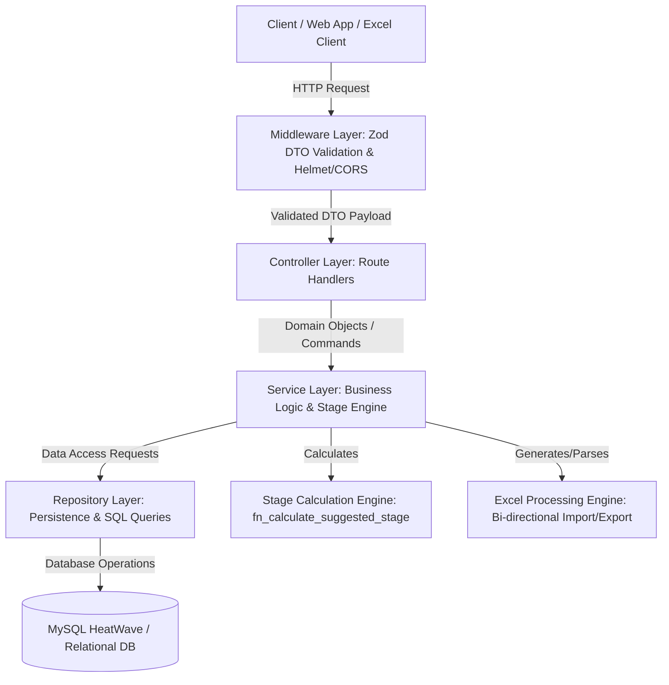

# Lumino1 Baseline Assessment - System Architecture Specification

## 1. High-Level Structural Layout
The backend application follows a strict **Clean Layered Architecture** (Controller -> Service -> Repository / Data Access Layer) to ensure complete decoupling, strict static typing, modularity, and testability.



## 2. Directory & Module Boundaries
```
backend/
├── docs/
│   └── backend/
│       ├── architecture.md    # System structural layout and workflow diagrams
│       ├── configuration.md   # Deployment, environment variables, validation rules
│       └── tracking.md        # API routes registry, endpoints, and future scopes 
├── src/
│   ├── config/          # Environment variables, database pools, logging instances
│   ├── constants/       # HTTP status codes, reusable message tokens, domain enums
│   ├── controllers/     # Route handlers (Request parsing, status responses, delegating to services)
│   ├── dtos/            # Zod validation schemas and structural interface definitions
│   ├── middlewares/     # Error handlers, rate limiters, validation runners
│   ├── repositories/    # Direct database interface logic / abstraction layer
│   ├── routes/          # Express route registration mappings
│   ├── services/        # Business logic domain, transactional boundaries, stage calculations
│   ├── utils/           # Helper scripts (AppError class, formatters, stage calculator)
│   └── index.ts         # Application entry point, server runtime listener
```

## 3. Data Processing & Calculation Pipeline
1. **Request Validation**: Zod middleware validates request headers, params, and body structure prior to controller invocation.
2. **Controller Layer**: Parses path/query parameters, calls appropriate service methods, and maps responses to standard JSON format.
3. **Service Layer**:
   - Executes domain business logic.
   - Computes suggested stage ratings (`S1`-`S5`, `Review`, `AB`) across all 7 domains (Vocabulary, Grammar, Phrase/Sentence, Listening, Speaking, Reading, Writing) using individual item ratings (0-4).
   - Manages bi-directional Excel translation.
4. **Repository Layer**: Handles persistence logic against `baseline_assessments` (Header) and `baseline_domain_scores` (Detail scores) tables.
