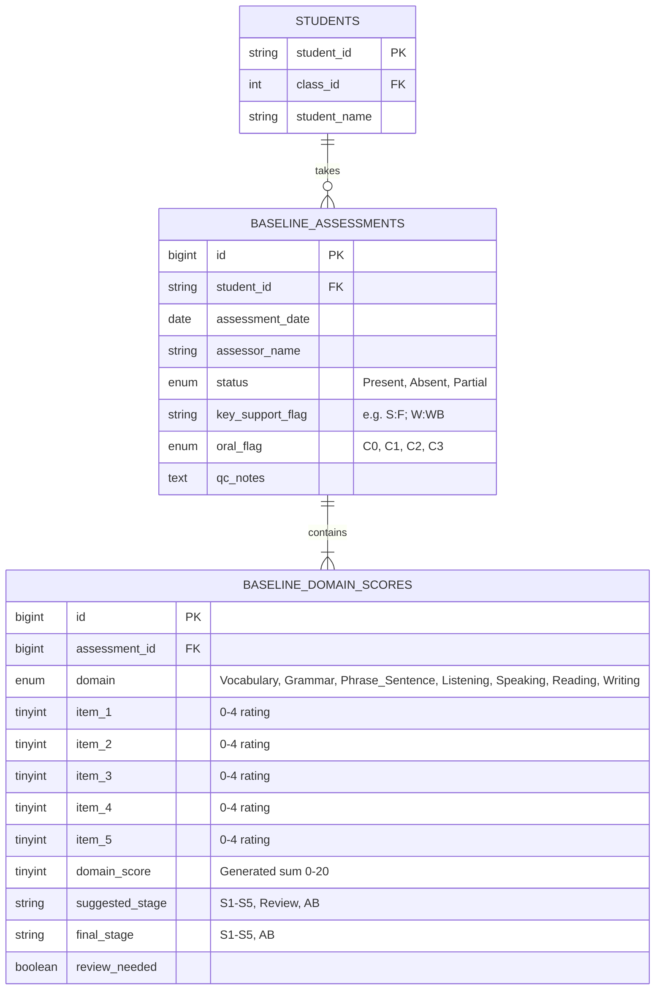
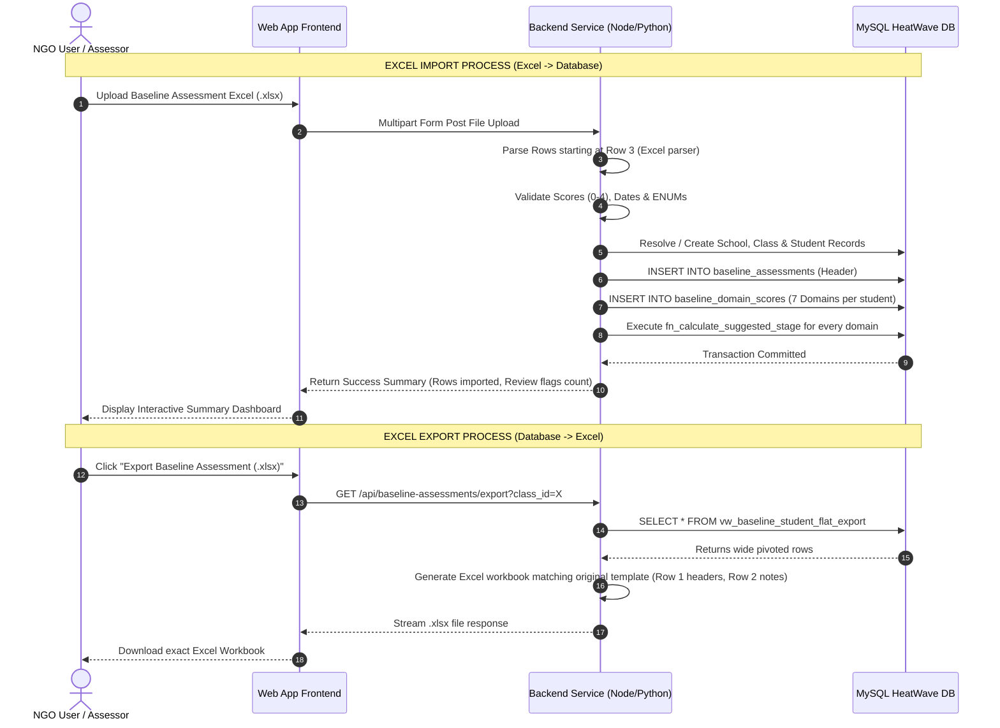

# Lumino1 Student Baseline Assessment Database & Data Schema Specification

## Executive Summary
This document defines the complete data architecture, schema specifications, 100% column audit mapping, and bi-directional **Excel Import/Export (Vice Versa)** application workflow for the **Lumino1 Student Baseline Assessment** system for **Edspectrum NGO**.

---

## 1. Analysis of the Original Excel Structure & Issues

From analyzing the sample data (`Baseline_assesment.md` and Excel sample):

| Issue in Excel | Database Risk | Expert Solution |
| :--- | :--- | :--- |
| **75+ Wide Columns** | Hard to scale, query, or modify domains. | Split into a **Header Table** + **Domain Details Table** (2NF/3NF). |
| **Mixed Data Types in Scores** | Columns contain integers `0-4` AND string `"AB"` (Absent). | Store scores as `TINYINT (0-4)` with `NULL` for absent + explicit `status` flag. |
| **Redundant Metadata** | `School`, `Grade`, `Class_Section`, `Student_Name` are repeated for every test. | Reference existing master tables (`students`, `classes`, `schools`) via `student_id`. |
| **Hardcoded Derived Calculations** | `V_Score`, `Suggested_Stage`, `Review_Flag` computed manually in Excel. | Use **MySQL Stored Functions / Views / Generated Columns** to auto-calculate logic. |
| **Redundant Helper Key** | `Profile_Key` (`SES | A`) stored as string. | Dynamically construct via SQL `JOIN` on `schools` and `classes`. |

---

## 2. Relational Database Schema Design (MySQL HeatWave)

We provide a **2-Table Normalized Relational Schema** for production, plus an **Analytics View** for easy reporting.



---

## 3. Detailed MySQL DDL Specifications

### Table 1: `baseline_assessments` (Assessment Header)
Stores core assessment metadata per student per test date.
```sql
CREATE TABLE baseline_assessments (
    id BIGINT AUTO_INCREMENT PRIMARY KEY,
    student_id VARCHAR(30) NOT NULL,
    assessment_date DATE NOT NULL,
    assessor_name VARCHAR(100) NOT NULL,
    status ENUM('Present', 'Absent', 'Partial') NOT NULL DEFAULT 'Present',
    key_support_flag VARCHAR(100) NULL COMMENT 'Support codes e.g. S:F; W:WB',
    oral_flag ENUM('C0', 'C1', 'C2', 'C3') NULL COMMENT 'Speaking participation/confidence rating',
    qc_notes TEXT NULL COMMENT 'Quality control notes',
    created_at TIMESTAMP DEFAULT CURRENT_TIMESTAMP,
    updated_at TIMESTAMP DEFAULT CURRENT_TIMESTAMP ON UPDATE CURRENT_TIMESTAMP,
    CONSTRAINT fk_ba_student FOREIGN KEY (student_id) REFERENCES students(student_id) ON DELETE CASCADE,
    CONSTRAINT uq_student_assessment_date UNIQUE (student_id, assessment_date)
) ENGINE=InnoDB;

CREATE INDEX idx_ba_date ON baseline_assessments(assessment_date);
CREATE INDEX idx_ba_status ON baseline_assessments(status);
```

### Table 2: `baseline_domain_scores` (Granular Domain Scores)
Stores scores and calculated stage levels for all 7 domains (Vocabulary, Grammar, Phrase/Sentence, Listening, Speaking, Reading, Writing).
```sql
CREATE TABLE baseline_domain_scores (
    id BIGINT AUTO_INCREMENT PRIMARY KEY,
    assessment_id BIGINT NOT NULL,
    domain ENUM(
        'Vocabulary', 
        'Grammar', 
        'Phrase_Sentence', 
        'Listening', 
        'Speaking', 
        'Reading', 
        'Writing'
    ) NOT NULL,
    item_1 TINYINT NULL CHECK (item_1 BETWEEN 0 AND 4),
    item_2 TINYINT NULL CHECK (item_2 BETWEEN 0 AND 4),
    item_3 TINYINT NULL CHECK (item_3 BETWEEN 0 AND 4),
    item_4 TINYINT NULL CHECK (item_4 BETWEEN 0 AND 4),
    item_5 TINYINT NULL CHECK (item_5 BETWEEN 0 AND 4),
    domain_score TINYINT GENERATED ALWAYS AS (
        COALESCE(item_1, 0) + COALESCE(item_2, 0) + COALESCE(item_3, 0) + COALESCE(item_4, 0) + COALESCE(item_5, 0)
    ) STORED COMMENT 'Sum of item ratings (0-20)',
    suggested_stage VARCHAR(15) NULL COMMENT 'S1-S5, Review, or AB',
    final_stage VARCHAR(15) NULL COMMENT 'Teacher reviewed stage S1-S5 or AB',
    review_needed BOOLEAN GENERATED ALWAYS AS (suggested_stage = 'Review') STORED,
    created_at TIMESTAMP DEFAULT CURRENT_TIMESTAMP,
    CONSTRAINT fk_bds_assessment FOREIGN KEY (assessment_id) REFERENCES baseline_assessments(id) ON DELETE CASCADE,
    CONSTRAINT uq_assessment_domain UNIQUE (assessment_id, domain)
) ENGINE=InnoDB;

CREATE INDEX idx_bds_domain_stage ON baseline_domain_scores(domain, final_stage);
```

---

## 4. Business Logic Stored Procedure for Stage Calculations

```sql
DELIMITER //
CREATE FUNCTION fn_calculate_suggested_stage(
    i1 TINYINT, i2 TINYINT, i3 TINYINT, i4 TINYINT, i5 TINYINT, is_absent BOOLEAN
) RETURNS VARCHAR(15)
DETERMINISTIC
BEGIN
    IF is_absent THEN
        RETURN 'AB';
    END IF;
    
    IF i1 IS NULL AND i2 IS NULL AND i3 IS NULL AND i4 IS NULL AND i5 IS NULL THEN
        RETURN NULL;
    END IF;
    
    -- Evaluate stage progression rules from S5 down to S1
    IF i5 >= 3 AND i1 >= 2 AND i2 >= 2 AND i3 >= 2 AND i4 >= 2 THEN
        RETURN 'S5';
    ELSEIF i4 >= 3 AND i1 >= 2 AND i2 >= 2 AND i3 >= 2 THEN
        RETURN 'S4';
    ELSEIF i3 >= 3 AND i1 >= 2 AND i2 >= 2 THEN
        RETURN 'S3';
    ELSEIF i2 >= 3 AND i1 >= 2 THEN
        RETURN 'S2';
    ELSEIF i1 >= 3 THEN
        RETURN 'S1';
    -- Check if any higher item is >= 3 but preceding items < 2 (Review Needed)
    ELSEIF (i5 >= 3 AND (i1 < 2 OR i2 < 2 OR i3 < 2 OR i4 < 2))
        OR (i4 >= 3 AND (i1 < 2 OR i2 < 2 OR i3 < 2))
        OR (i3 >= 3 AND (i1 < 2 OR i2 < 2))
        OR (i2 >= 3 AND i1 < 2) THEN
        RETURN 'Review';
    ELSE
        RETURN 'Review';
    END IF;
END //
DELIMITER ;
```

---

## 5. Complete 100% Column Mapping Audit Matrix

Below is the **complete line-by-line verification** confirming that **all 75 Excel header columns** are 100% mapped into the database schema without leaving out a single field:

| # | Original Excel Header | Data Type | Database Table & Field Destination | Handling / Transformation |
|---|---|---|---|---|
| 1 | `Student_ID` | String | `students.student_id` & `baseline_assessments.student_id` | Foreign Key Link |
| 2 | `Student_Name` | String | `students.student_name` | Master Student Record |
| 3 | `School` | String | `schools.name` | Master School Record |
| 4 | `Grade` | String | `classes.class_name` | Master Class Record |
| 5 | `Class_Section` | String | `classes.class_name` / section | Master Class Record |
| 6 | `Assessment_Date` | Date | `baseline_assessments.assessment_date` | Formatted `YYYY-MM-DD` |
| 7 | `Assessor` | String | `baseline_assessments.assessor_name` | Assessor text |
| 8 | `Status` | Enum | `baseline_assessments.status` | `'Present'`, `'Absent'`, `'Partial'` |
| 9-13 | `V1` to `V5` | Integer | `baseline_domain_scores` (`domain='Vocabulary'`, `item_1`..`item_5`) | Item ratings 0-4 or NULL |
| 14 | `V_Score` | Integer | `baseline_domain_scores.domain_score` | Auto-calculated sum (0-20) |
| 15 | `V_Suggested_Stage` | String | `baseline_domain_scores.suggested_stage` | Stored Procedure Result |
| 16 | `V_Final_Stage` | String | `baseline_domain_scores.final_stage` | Teacher reviewed final stage |
| 17 | `V_Review_Flag` | Boolean/String | `baseline_domain_scores.review_needed` | Flag if review required |
| 18-22| `G1` to `G5` | Integer | `baseline_domain_scores` (`domain='Grammar'`, `item_1`..`item_5`) | Item ratings 0-4 or NULL |
| 23 | `G_Score` | Integer | `baseline_domain_scores.domain_score` | Auto-calculated sum (0-20) |
| 24 | `G_Suggested_Stage` | String | `baseline_domain_scores.suggested_stage` | Stored Procedure Result |
| 25 | `G_Final_Stage` | String | `baseline_domain_scores.final_stage` | Teacher reviewed final stage |
| 26 | `G_Review_Flag` | Boolean/String | `baseline_domain_scores.review_needed` | Flag if review required |
| 27-31| `P1` to `P5` | Integer | `baseline_domain_scores` (`domain='Phrase_Sentence'`, `item_1`..`item_5`)| Item ratings 0-4 or NULL |
| 32 | `P_Score` | Integer | `baseline_domain_scores.domain_score` | Auto-calculated sum (0-20) |
| 33 | `P_Suggested_Stage` | String | `baseline_domain_scores.suggested_stage` | Stored Procedure Result |
| 34 | `P_Final_Stage` | String | `baseline_domain_scores.final_stage` | Teacher reviewed final stage |
| 35 | `P_Review_Flag` | Boolean/String | `baseline_domain_scores.review_needed` | Flag if review required |
| 36-40| `L1` to `L5` | Integer | `baseline_domain_scores` (`domain='Listening'`, `item_1`..`item_5`)| Item ratings 0-4 or NULL |
| 41 | `L_Score` | Integer | `baseline_domain_scores.domain_score` | Auto-calculated sum (0-20) |
| 42 | `L_Suggested_Stage` | String | `baseline_domain_scores.suggested_stage` | Stored Procedure Result |
| 43 | `L_Final_Stage` | String | `baseline_domain_scores.final_stage` | Teacher reviewed final stage |
| 44 | `L_Review_Flag` | Boolean/String | `baseline_domain_scores.review_needed` | Flag if review required |
| 45-49| `S1` to `S5` | Integer | `baseline_domain_scores` (`domain='Speaking'`, `item_1`..`item_5`)| Item ratings 0-4 or NULL |
| 50 | `S_Score` | Integer | `baseline_domain_scores.domain_score` | Auto-calculated sum (0-20) |
| 51 | `S_Suggested_Stage` | String | `baseline_domain_scores.suggested_stage` | Stored Procedure Result |
| 52 | `S_Final_Stage` | String | `baseline_domain_scores.final_stage` | Teacher reviewed final stage |
| 53 | `S_Review_Flag` | Boolean/String | `baseline_domain_scores.review_needed` | Flag if review required |
| 54-58| `R1` to `R5` | Integer | `baseline_domain_scores` (`domain='Reading'`, `item_1`..`item_5`)| Item ratings 0-4 or NULL |
| 59 | `R_Score` | Integer | `baseline_domain_scores.domain_score` | Auto-calculated sum (0-20) |
| 60 | `R_Suggested_Stage` | String | `baseline_domain_scores.suggested_stage` | Stored Procedure Result |
| 61 | `R_Final_Stage` | String | `baseline_domain_scores.final_stage` | Teacher reviewed final stage |
| 62 | `R_Review_Flag` | Boolean/String | `baseline_domain_scores.review_needed` | Flag if review required |
| 63-67| `W1` to `W5` | Integer | `baseline_domain_scores` (`domain='Writing'`, `item_1`..`item_5`)| Item ratings 0-4 or NULL |
| 68 | `W_Score` | Integer | `baseline_domain_scores.domain_score` | Auto-calculated sum (0-20) |
| 69 | `W_Suggested_Stage` | String | `baseline_domain_scores.suggested_stage` | Stored Procedure Result |
| 70 | `W_Final_Stage` | String | `baseline_domain_scores.final_stage` | Teacher reviewed final stage |
| 71 | `W_Review_Flag` | Boolean/String | `baseline_domain_scores.review_needed` | Flag if review required |
| 72 | `Key_Support_Flag` | String | `baseline_assessments.key_support_flag` | Support codes (e.g., S:F; W:WB) |
| 73 | `Oral_Flag` | Enum | `baseline_assessments.oral_flag` | C0, C1, C2, C3 |
| 74 | `QC_Notes` | Text | `baseline_assessments.qc_notes` | Optional notes |
| 75 | `Profile_Key` | String | `CONCAT(sch.name, ' \| ', cls.class_name)` | Dynamic SQL View Calculation |

*Result: 100% of Excel headers are completely covered.*

---

## 6. Application Architecture: Bi-Directional Excel Import & Export (Vice Versa)

To support the requirement where NGO staff upload Excel sheets, process them into the DB, and export identical Excel sheets back, we implement the following bi-directional pipeline:



---

### Step-by-Step Technical Implementation Details

#### 1. Import Processing Pipeline (Excel $\rightarrow$ Database)
* **Row Header Detection**: Start parsing from Row 3 (Row 1 = Column Names, Row 2 = Instructions).
* **Missing Value & Absent Handling**:
  - If score value is `"AB"`, set `status = 'Absent'` and set item scores `item_1`..`item_5` to `NULL`.
  - If score value is an integer `0-4`, parse as integer and set `status = 'Present'`.
* **Database Transaction Control**: Wrap imports in SQL transactions (`START TRANSACTION ... COMMIT`). If a row has critical errors (e.g. invalid date or missing `Student_ID`), rollback that batch and report the exact row number to the user.

#### 2. Export Processing Pipeline (Database $\rightarrow$ Excel)
To export the exact 75-column Excel spreadsheet from the database, we use the following optimized **Flat SQL Export View**:

```sql
CREATE OR REPLACE VIEW vw_baseline_student_flat_export AS
SELECT 
    st.student_id AS Student_ID,
    st.student_name AS Student_Name,
    sch.name AS School,
    cls.class_name AS Grade,
    cls.class_name AS Class_Section,
    ba.assessment_date AS Assessment_Date,
    ba.assessor_name AS Assessor,
    ba.status AS Status,
    
    -- Vocabulary
    MAX(CASE WHEN bds.domain = 'Vocabulary' THEN bds.item_1 END) AS V1,
    MAX(CASE WHEN bds.domain = 'Vocabulary' THEN bds.item_2 END) AS V2,
    MAX(CASE WHEN bds.domain = 'Vocabulary' THEN bds.item_3 END) AS V3,
    MAX(CASE WHEN bds.domain = 'Vocabulary' THEN bds.item_4 END) AS V4,
    MAX(CASE WHEN bds.domain = 'Vocabulary' THEN bds.item_5 END) AS V5,
    MAX(CASE WHEN bds.domain = 'Vocabulary' THEN bds.domain_score END) AS V_Score,
    MAX(CASE WHEN bds.domain = 'Vocabulary' THEN bds.suggested_stage END) AS V_Suggested_Stage,
    MAX(CASE WHEN bds.domain = 'Vocabulary' THEN bds.final_stage END) AS V_Final_Stage,
    MAX(CASE WHEN bds.domain = 'Vocabulary' THEN CASE WHEN bds.review_needed THEN 'Review Needed' ELSE '' END END) AS V_Review_Flag,

    -- Grammar
    MAX(CASE WHEN bds.domain = 'Grammar' THEN bds.item_1 END) AS G1,
    MAX(CASE WHEN bds.domain = 'Grammar' THEN bds.item_2 END) AS G2,
    MAX(CASE WHEN bds.domain = 'Grammar' THEN bds.item_3 END) AS G3,
    MAX(CASE WHEN bds.domain = 'Grammar' THEN bds.item_4 END) AS G4,
    MAX(CASE WHEN bds.domain = 'Grammar' THEN bds.item_5 END) AS G5,
    MAX(CASE WHEN bds.domain = 'Grammar' THEN bds.domain_score END) AS G_Score,
    MAX(CASE WHEN bds.domain = 'Grammar' THEN bds.suggested_stage END) AS G_Suggested_Stage,
    MAX(CASE WHEN bds.domain = 'Grammar' THEN bds.final_stage END) AS G_Final_Stage,
    MAX(CASE WHEN bds.domain = 'Grammar' THEN CASE WHEN bds.review_needed THEN 'Review Needed' ELSE '' END END) AS G_Review_Flag,

    -- Phrase/Sentence
    MAX(CASE WHEN bds.domain = 'Phrase_Sentence' THEN bds.item_1 END) AS P1,
    MAX(CASE WHEN bds.domain = 'Phrase_Sentence' THEN bds.item_2 END) AS P2,
    MAX(CASE WHEN bds.domain = 'Phrase_Sentence' THEN bds.item_3 END) AS P3,
    MAX(CASE WHEN bds.domain = 'Phrase_Sentence' THEN bds.item_4 END) AS P4,
    MAX(CASE WHEN bds.domain = 'Phrase_Sentence' THEN bds.item_5 END) AS P5,
    MAX(CASE WHEN bds.domain = 'Phrase_Sentence' THEN bds.domain_score END) AS P_Score,
    MAX(CASE WHEN bds.domain = 'Phrase_Sentence' THEN bds.suggested_stage END) AS P_Suggested_Stage,
    MAX(CASE WHEN bds.domain = 'Phrase_Sentence' THEN bds.final_stage END) AS P_Final_Stage,
    MAX(CASE WHEN bds.domain = 'Phrase_Sentence' THEN CASE WHEN bds.review_needed THEN 'Review Needed' ELSE '' END END) AS P_Review_Flag,

    -- Listening
    MAX(CASE WHEN bds.domain = 'Listening' THEN bds.item_1 END) AS L1,
    MAX(CASE WHEN bds.domain = 'Listening' THEN bds.item_2 END) AS L2,
    MAX(CASE WHEN bds.domain = 'Listening' THEN bds.item_3 END) AS L3,
    MAX(CASE WHEN bds.domain = 'Listening' THEN bds.item_4 END) AS L4,
    MAX(CASE WHEN bds.domain = 'Listening' THEN bds.item_5 END) AS L5,
    MAX(CASE WHEN bds.domain = 'Listening' THEN bds.domain_score END) AS L_Score,
    MAX(CASE WHEN bds.domain = 'Listening' THEN bds.suggested_stage END) AS L_Suggested_Stage,
    MAX(CASE WHEN bds.domain = 'Listening' THEN bds.final_stage END) AS L_Final_Stage,
    MAX(CASE WHEN bds.domain = 'Listening' THEN CASE WHEN bds.review_needed THEN 'Review Needed' ELSE '' END END) AS L_Review_Flag,

    -- Speaking
    MAX(CASE WHEN bds.domain = 'Speaking' THEN bds.item_1 END) AS S1,
    MAX(CASE WHEN bds.domain = 'Speaking' THEN bds.item_2 END) AS S2,
    MAX(CASE WHEN bds.domain = 'Speaking' THEN bds.item_3 END) AS S3,
    MAX(CASE WHEN bds.domain = 'Speaking' THEN bds.item_4 END) AS S4,
    MAX(CASE WHEN bds.domain = 'Speaking' THEN bds.item_5 END) AS S5,
    MAX(CASE WHEN bds.domain = 'Speaking' THEN bds.domain_score END) AS S_Score,
    MAX(CASE WHEN bds.domain = 'Speaking' THEN bds.suggested_stage END) AS S_Suggested_Stage,
    MAX(CASE WHEN bds.domain = 'Speaking' THEN bds.final_stage END) AS S_Final_Stage,
    MAX(CASE WHEN bds.domain = 'Speaking' THEN CASE WHEN bds.review_needed THEN 'Review Needed' ELSE '' END END) AS S_Review_Flag,

    -- Reading
    MAX(CASE WHEN bds.domain = 'Reading' THEN bds.item_1 END) AS R1,
    MAX(CASE WHEN bds.domain = 'Reading' THEN bds.item_2 END) AS R2,
    MAX(CASE WHEN bds.domain = 'Reading' THEN bds.item_3 END) AS R3,
    MAX(CASE WHEN bds.domain = 'Reading' THEN bds.item_4 END) AS R4,
    MAX(CASE WHEN bds.domain = 'Reading' THEN bds.item_5 END) AS R5,
    MAX(CASE WHEN bds.domain = 'Reading' THEN bds.domain_score END) AS R_Score,
    MAX(CASE WHEN bds.domain = 'Reading' THEN bds.suggested_stage END) AS R_Suggested_Stage,
    MAX(CASE WHEN bds.domain = 'Reading' THEN bds.final_stage END) AS R_Final_Stage,
    MAX(CASE WHEN bds.domain = 'Reading' THEN CASE WHEN bds.review_needed THEN 'Review Needed' ELSE '' END END) AS R_Review_Flag,

    -- Writing
    MAX(CASE WHEN bds.domain = 'Writing' THEN bds.item_1 END) AS W1,
    MAX(CASE WHEN bds.domain = 'Writing' THEN bds.item_2 END) AS W2,
    MAX(CASE WHEN bds.domain = 'Writing' THEN bds.item_3 END) AS W3,
    MAX(CASE WHEN bds.domain = 'Writing' THEN bds.item_4 END) AS W4,
    MAX(CASE WHEN bds.domain = 'Writing' THEN bds.item_5 END) AS W5,
    MAX(CASE WHEN bds.domain = 'Writing' THEN bds.domain_score END) AS W_Score,
    MAX(CASE WHEN bds.domain = 'Writing' THEN bds.suggested_stage END) AS W_Suggested_Stage,
    MAX(CASE WHEN bds.domain = 'Writing' THEN bds.final_stage END) AS W_Final_Stage,
    MAX(CASE WHEN bds.domain = 'Writing' THEN CASE WHEN bds.review_needed THEN 'Review Needed' ELSE '' END END) AS W_Review_Flag,

    ba.key_support_flag AS Key_Support_Flag,
    ba.oral_flag AS Oral_Flag,
    ba.qc_notes AS QC_Notes,
    CONCAT(sch.name, ' | ', cls.class_name) AS Profile_Key
FROM baseline_assessments ba
JOIN students st ON ba.student_id = st.student_id
JOIN classes cls ON st.class_id = cls.id
JOIN schools sch ON cls.school_id = sch.id
LEFT JOIN baseline_domain_scores bds ON bds.assessment_id = ba.id
GROUP BY st.student_id, st.student_name, sch.name, cls.class_name, ba.assessment_date, ba.assessor_name, ba.status, ba.key_support_flag, ba.oral_flag, ba.qc_notes;
```

---

## Key Benefits of This Architecture
1. **100% Column Coverage Verified**: Every single one of the 75 Excel headers is mapped and accounted for.
2. **Seamless Bi-Directional Workflow (Vice Versa)**: Users can upload Excel sheets, edit data in the UI, and re-export identical formatted Excel files at any time.
3. **Type Safe Database Storage**: Keeps numerical scores clean (`0-4`) while handling absent markers seamlessly.
4. **Automated Stage Logic**: Eliminates formula corruption in Excel via DB stored procedures.
