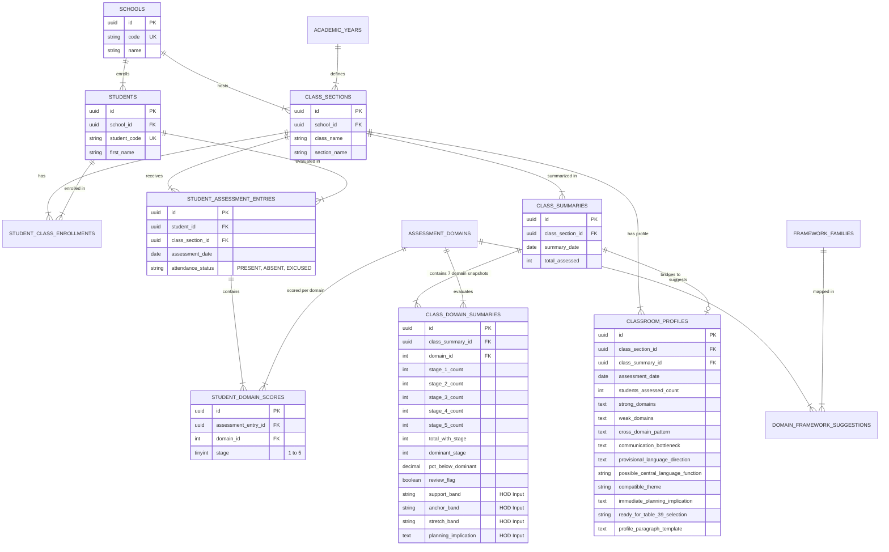

# Lumino1 Class Summary & Classroom Profile Database Schema Specification

## Executive Summary
This document defines the complete database architecture, schema specification, relational design, and HOD instructional planning bridge for the **Lumino1 Class Summary (Domain Distribution & SAS Map)** and **Classroom Profile** modules of the **Edspectrum NGO Platform**.

It integrates directly with the NGO Master Database (Single Source of Truth) comprising `schools`, `classes` / `class_sections`, and `students`, enabling multi-tenant school operations, real-time stage distribution metrics, and academic instructional planning.

---

## 1. Analysis of Requirements & Domain Specification

Based on [`class_profile.md`](file:///c:/Users/av311/Desktop/NGO-app/Docs/class_profile.md) and [`Class-summary.md`](file:///c:/Users/av311/Desktop/NGO-app/Docs/Class-summary.md):

| Feature / Business Logic | Spreadsheet / Manual Mechanism | Relational Database Design & Solution |
| :--- | :--- | :--- |
| **Filtered Class Summary** | Filtered by School and Class/Section on `01_Individual_Entry` for Present students. | Foreign key linkage (`class_section_id`, `attendance_status = 'PRESENT'`) dynamically aggregated via SQL Views or Cached Snapshots. |
| **Stage Distribution (S1 to S5)** | Counts students at each achievement stage per domain. | Store individual student domain scores (`student_domain_scores`) and aggregate into distribution counts (`stage_1_count` ... `stage_5_count`). |
| **Dominant Stage Calculation** | Calculated from largest count of students at a stage (not average). | Evaluated via SQL windowing / CASE logic finding `MAX(count)` per domain. |
| **% Below Dominant** | Formula summing counts below dominant stage divided by `total_with_stage`. | Precise mathematical evaluation in stored/generated columns or reporting views. |
| **Review Flag (> 35%)** | Flag set if `% below dominant > 0.35` (35% exact is OK, 35.1% triggers flag). | `review_flag` GENERATED column: `(pct_below_dominant > 0.3500)`. |
| **HOD Planning Bands** | Manual input for Support, Anchor, Stretch bands per domain by Head of Dept. | Explicit columns (`support_band`, `anchor_band`, `stretch_band`) in `class_domain_summaries`. |
| **Planning Implication** | Manual qualitative input by HOD based on class performance pattern. | `planning_implication` text field preserved per domain summary snapshot. |
| **Classroom Profile Bridge** | Qualitative fields: Strong/Weak domains, Bottleneck, Central Language Function, Theme, Table 39 Readiness. | Structured `classroom_profiles` entity capturing narrative template & Table 39 planning status. |
| **Suggested Framework Families** | Fixed mapping (e.g. Vocabulary -> MEU, Functional Phonics, RRI). | Lookup table `framework_families` and junction table `domain_framework_suggestions`. |

---

## 2. Relational Master Architecture & ER Diagram

The ER diagram below demonstrates how the **Lumino1 Class Summary & Classroom Profile** modules integrate with core NGO master tables (`schools`, `class_sections`, `students`) and raw individual assessment entries:



---

## 3. Database Schema DDL (PostgreSQL 16 / ANSI SQL)

### 3.1 Core Master & Institutional Hierarchy Tables

```sql
-- PostgreSQL 16 DDL for Lumino1 Classroom Profile & Class Summary Schema

CREATE EXTENSION IF NOT EXISTS "uuid-ossp";

-- 1. Schools Master Table
CREATE TABLE schools (
    id UUID PRIMARY KEY DEFAULT gen_random_uuid(),
    code VARCHAR(30) NOT NULL UNIQUE,
    name VARCHAR(255) NOT NULL,
    address TEXT,
    created_at TIMESTAMPTZ NOT NULL DEFAULT CURRENT_TIMESTAMP,
    updated_at TIMESTAMPTZ NOT NULL DEFAULT CURRENT_TIMESTAMP,
    deleted_at TIMESTAMPTZ
);

-- 2. Academic Years
CREATE TABLE academic_years (
    id UUID PRIMARY KEY DEFAULT gen_random_uuid(),
    school_id UUID NOT NULL REFERENCES schools(id) ON DELETE RESTRICT,
    name VARCHAR(50) NOT NULL,
    start_date DATE NOT NULL,
    end_date DATE NOT NULL,
    created_at TIMESTAMPTZ NOT NULL DEFAULT CURRENT_TIMESTAMP,
    updated_at TIMESTAMPTZ NOT NULL DEFAULT CURRENT_TIMESTAMP,
    deleted_at TIMESTAMPTZ,
    CONSTRAINT check_academic_year_dates CHECK (end_date > start_date)
);

-- 3. Class & Section Master Table
CREATE TABLE class_sections (
    id UUID PRIMARY KEY DEFAULT gen_random_uuid(),
    school_id UUID NOT NULL REFERENCES schools(id) ON DELETE RESTRICT,
    academic_year_id UUID NOT NULL REFERENCES academic_years(id) ON DELETE RESTRICT,
    class_name VARCHAR(50) NOT NULL,
    section_name VARCHAR(20) NOT NULL,
    created_at TIMESTAMPTZ NOT NULL DEFAULT CURRENT_TIMESTAMP,
    updated_at TIMESTAMPTZ NOT NULL DEFAULT CURRENT_TIMESTAMP,
    deleted_at TIMESTAMPTZ,
    CONSTRAINT uq_class_section UNIQUE (school_id, academic_year_id, class_name, section_name)
);

-- 4. Student Master Table
CREATE TABLE students (
    id UUID PRIMARY KEY DEFAULT gen_random_uuid(),
    school_id UUID NOT NULL REFERENCES schools(id) ON DELETE RESTRICT,
    student_code VARCHAR(50) NOT NULL,
    first_name VARCHAR(100) NOT NULL,
    last_name VARCHAR(100),
    created_at TIMESTAMPTZ NOT NULL DEFAULT CURRENT_TIMESTAMP,
    updated_at TIMESTAMPTZ NOT NULL DEFAULT CURRENT_TIMESTAMP,
    deleted_at TIMESTAMPTZ,
    CONSTRAINT uq_school_student_code UNIQUE (school_id, student_code)
);

-- 5. Student Enrollment Junction Table
CREATE TABLE student_class_enrollments (
    id UUID PRIMARY KEY DEFAULT gen_random_uuid(),
    student_id UUID NOT NULL REFERENCES students(id) ON DELETE CASCADE,
    class_section_id UUID NOT NULL REFERENCES class_sections(id) ON DELETE CASCADE,
    is_active BOOLEAN NOT NULL DEFAULT TRUE,
    created_at TIMESTAMPTZ NOT NULL DEFAULT CURRENT_TIMESTAMP,
    CONSTRAINT uq_student_class UNIQUE (student_id, class_section_id)
);
```

---

### 3.2 Assessment Domains & Framework Family Master Data

```sql
-- 6. Assessment Domains (7 Standardized Domains)
CREATE TABLE assessment_domains (
    id INT PRIMARY KEY,
    code VARCHAR(50) NOT NULL UNIQUE,
    name VARCHAR(100) NOT NULL,
    display_order INT NOT NULL
);

INSERT INTO assessment_domains (id, code, name, display_order) VALUES
(1, 'VOCABULARY', 'Vocabulary', 1),
(2, 'GRAMMAR_PATTERN', 'Grammar/Pattern', 2),
(3, 'PHRASE_SENTENCE', 'Phrase/Sentence', 3),
(4, 'LISTENING', 'Listening', 4),
(5, 'SPEAKING', 'Speaking', 5),
(6, 'READING', 'Reading', 6),
(7, 'WRITING', 'Writing', 7);

-- 7. Framework Families (Lookup & Catalog)
CREATE TABLE framework_families (
    id UUID PRIMARY KEY DEFAULT gen_random_uuid(),
    code VARCHAR(30) NOT NULL UNIQUE,
    name VARCHAR(150) NOT NULL,
    description TEXT
);

INSERT INTO framework_families (code, name, description) VALUES
('MEU', 'MEU', 'To be confirmed by academic team'),
('Functional Phonics', 'Functional Phonics', 'To be confirmed by academic team'),
('RRI', 'RRI', 'To be confirmed by academic team'),
('NPU', 'NPU', 'To be confirmed by academic team'),
('FEC', 'FEC', 'To be confirmed by academic team'),
('3L', '3L', 'To be confirmed by academic team'),
('PRSP', 'PRSP', 'To be confirmed by academic team'),
('PERC', 'PERC', 'To be confirmed by academic team'),
('LIT', 'LIT', 'To be confirmed by academic team'),
('IWDR', 'IWDR', 'To be confirmed by academic team');

-- 8. Domain Suggested Framework Families Junction Table
CREATE TABLE domain_framework_suggestions (
    domain_id INT NOT NULL REFERENCES assessment_domains(id) ON DELETE CASCADE,
    framework_family_id UUID NOT NULL REFERENCES framework_families(id) ON DELETE CASCADE,
    PRIMARY KEY (domain_id, framework_family_id)
);

INSERT INTO domain_framework_suggestions (domain_id, framework_family_id)
SELECT d.id, f.id
FROM assessment_domains d, framework_families f
WHERE (d.code = 'VOCABULARY' AND f.code IN ('MEU', 'Functional Phonics', 'RRI'))
   OR (d.code = 'GRAMMAR_PATTERN' AND f.code IN ('NPU', 'RRI'))
   OR (d.code = 'PHRASE_SENTENCE' AND f.code IN ('FEC', 'RRI'))
   OR (d.code = 'LISTENING' AND f.code IN ('3L', 'RRI'))
   OR (d.code = 'SPEAKING' AND f.code IN ('PRSP', 'RRI'))
   OR (d.code = 'READING' AND f.code IN ('PERC', 'LIT', 'RRI'))
   OR (d.code = 'WRITING' AND f.code IN ('IWDR', 'RRI'));
```

---

### 3.3 Student Individual Assessment Entries (`01_Individual_Entry`)

```sql
-- 9. Assessment Session Header
CREATE TABLE student_assessment_entries (
    id UUID PRIMARY KEY DEFAULT gen_random_uuid(),
    student_id UUID NOT NULL REFERENCES students(id) ON DELETE CASCADE,
    class_section_id UUID NOT NULL REFERENCES class_sections(id) ON DELETE RESTRICT,
    assessment_date DATE NOT NULL,
    attendance_status VARCHAR(20) NOT NULL DEFAULT 'PRESENT',
    assessed_by UUID,
    created_at TIMESTAMPTZ NOT NULL DEFAULT CURRENT_TIMESTAMP,
    updated_at TIMESTAMPTZ NOT NULL DEFAULT CURRENT_TIMESTAMP,
    CONSTRAINT check_attendance_status CHECK (attendance_status IN ('PRESENT', 'ABSENT', 'EXCUSED'))
);

-- 10. Granular Domain Scores per Student Assessment
CREATE TABLE student_domain_scores (
    id UUID PRIMARY KEY DEFAULT gen_random_uuid(),
    assessment_entry_id UUID NOT NULL REFERENCES student_assessment_entries(id) ON DELETE CASCADE,
    domain_id INT NOT NULL REFERENCES assessment_domains(id) ON DELETE RESTRICT,
    stage SMALLINT NOT NULL,
    created_at TIMESTAMPTZ NOT NULL DEFAULT CURRENT_TIMESTAMP,
    CONSTRAINT check_stage_range CHECK (stage BETWEEN 1 AND 5),
    CONSTRAINT uq_entry_domain UNIQUE (assessment_entry_id, domain_id)
);
```

---

### 3.4 Aggregated Class Summary & HOD Planning Snapshot Tables

```sql
-- 11. Class Summary Header Snapshot
CREATE TABLE class_summaries (
    id UUID PRIMARY KEY DEFAULT gen_random_uuid(),
    class_section_id UUID NOT NULL REFERENCES class_sections(id) ON DELETE RESTRICT,
    summary_date DATE NOT NULL,
    total_assessed INT NOT NULL DEFAULT 0,
    created_at TIMESTAMPTZ NOT NULL DEFAULT CURRENT_TIMESTAMP,
    updated_at TIMESTAMPTZ NOT NULL DEFAULT CURRENT_TIMESTAMP
);

-- 12. Per-Domain Distribution & HOD Planning Fields
CREATE TABLE class_domain_summaries (
    id UUID PRIMARY KEY DEFAULT gen_random_uuid(),
    class_summary_id UUID NOT NULL REFERENCES class_summaries(id) ON DELETE CASCADE,
    domain_id INT NOT NULL REFERENCES assessment_domains(id) ON DELETE RESTRICT,
    stage_1_count INT NOT NULL DEFAULT 0,
    stage_2_count INT NOT NULL DEFAULT 0,
    stage_3_count INT NOT NULL DEFAULT 0,
    stage_4_count INT NOT NULL DEFAULT 0,
    stage_5_count INT NOT NULL DEFAULT 0,
    
    -- Auto-calculated total assessed with valid stage
    total_with_stage INT GENERATED ALWAYS AS (
        stage_1_count + stage_2_count + stage_3_count + stage_4_count + stage_5_count
    ) STORED,
    
    dominant_stage SMALLINT,
    pct_below_dominant NUMERIC(5, 4),
    
    -- Review flag automatically set TRUE when >35% of students perform below dominant stage
    review_flag BOOLEAN GENERATED ALWAYS AS (pct_below_dominant > 0.3500) STORED,
    
    -- Manually entered HOD planning bands & implications
    support_band VARCHAR(50),
    anchor_band VARCHAR(50),
    stretch_band VARCHAR(50),
    planning_implication TEXT,
    
    created_at TIMESTAMPTZ NOT NULL DEFAULT CURRENT_TIMESTAMP,
    updated_at TIMESTAMPTZ NOT NULL DEFAULT CURRENT_TIMESTAMP,
    
    CONSTRAINT check_dominant_stage_range CHECK (dominant_stage IS NULL OR dominant_stage BETWEEN 1 AND 5),
    CONSTRAINT check_pct_range CHECK (pct_below_dominant IS NULL OR (pct_below_dominant >= 0 AND pct_below_dominant <= 1.0)),
    CONSTRAINT uq_summary_domain UNIQUE (class_summary_id, domain_id)
);
```

---

### 3.5 Lumino1 Classroom Profile & Planning Bridge (`class_profile.md`)

```sql
-- 13. Classroom Profile & Planning Bridge Table
CREATE TABLE classroom_profiles (
    id UUID PRIMARY KEY DEFAULT gen_random_uuid(),
    class_section_id UUID NOT NULL REFERENCES class_sections(id) ON DELETE RESTRICT,
    class_summary_id UUID REFERENCES class_summaries(id) ON DELETE SET NULL,
    assessment_date DATE NOT NULL,
    students_assessed_count INT NOT NULL DEFAULT 0,
    
    -- Qualitative & Planning fields
    strong_domains TEXT,
    weak_domains TEXT,
    cross_domain_pattern TEXT, -- Manual input based on 06_Cross_Domain_Guide
    communication_bottleneck TEXT, -- Main language bottleneck blocking communication
    provisional_language_direction TEXT,
    possible_central_language_function VARCHAR(150),
    compatible_theme VARCHAR(150),
    immediate_planning_implication TEXT,
    
    -- Readiness for Table 39 row-bundle selection
    ready_for_table_39_selection VARCHAR(100) NOT NULL 
        DEFAULT 'No - select school/class and enter data',
        
    -- Classroom Profile Paragraph Narrative Template
    profile_paragraph_template TEXT,
    
    created_at TIMESTAMPTZ NOT NULL DEFAULT CURRENT_TIMESTAMP,
    updated_at TIMESTAMPTZ NOT NULL DEFAULT CURRENT_TIMESTAMP
);
```

---

## 4. High-Performance Indexing Strategy

```sql
-- Indexes for Assessment Filtering & Speed
CREATE INDEX idx_student_entries_filtering 
    ON student_assessment_entries(class_section_id, attendance_status, assessment_date);

CREATE INDEX idx_domain_scores_entry 
    ON student_domain_scores(assessment_entry_id, domain_id, stage);

CREATE INDEX idx_class_sections_lookup 
    ON class_sections(school_id, academic_year_id, class_name, section_name);

CREATE INDEX idx_students_school 
    ON students(school_id, student_code);

CREATE INDEX idx_class_domain_summaries_summary 
    ON class_domain_summaries(class_summary_id);

CREATE INDEX idx_classroom_profiles_section 
    ON classroom_profiles(class_section_id, assessment_date);
```

---

## 5. Automated Real-Time Class Summary Analytics View

This SQL View dynamically aggregates student-level assessment data from `student_assessment_entries` (`01_Individual_Entry`) for present students, calculating Stage distributions, Dominant Stage, % Below Dominant, and Review Flag logic in real time:

```sql
CREATE OR REPLACE VIEW vw_live_class_summary AS
WITH stage_counts AS (
    SELECT 
        e.class_section_id,
        s.domain_id,
        COUNT(CASE WHEN s.stage = 1 THEN 1 END) AS s1,
        COUNT(CASE WHEN s.stage = 2 THEN 1 END) AS s2,
        COUNT(CASE WHEN s.stage = 3 THEN 1 END) AS s3,
        COUNT(CASE WHEN s.stage = 4 THEN 1 END) AS s4,
        COUNT(CASE WHEN s.stage = 5 THEN 1 END) AS s5,
        COUNT(s.stage) AS total_with_stage
    FROM student_assessment_entries e
    JOIN student_domain_scores s ON e.id = s.assessment_entry_id
    WHERE e.attendance_status = 'PRESENT'
    GROUP BY e.class_section_id, s.domain_id
),
dominant_calc AS (
    SELECT 
        sc.*,
        -- Determine Dominant Stage based on maximum student count
        (
            SELECT stage_num FROM (
                VALUES (1, s1), (2, s2), (3, s3), (4, s4), (5, s5)
            ) AS v(stage_num, cnt)
            ORDER BY cnt DESC, stage_num ASC
            LIMIT 1
        ) AS dominant_stage
    FROM stage_counts sc
),
final_calc AS (
    SELECT 
        dc.*,
        -- Calculate total count of students strictly below dominant stage
        CASE 
            WHEN dc.dominant_stage = 1 THEN 0
            WHEN dc.dominant_stage = 2 THEN dc.s1
            WHEN dc.dominant_stage = 3 THEN dc.s1 + dc.s2
            WHEN dc.dominant_stage = 4 THEN dc.s1 + dc.s2 + dc.s3
            WHEN dc.dominant_stage = 5 THEN dc.s1 + dc.s2 + dc.s3 + dc.s4
            ELSE 0
        END AS count_below_dominant
    FROM dominant_calc dc
)
SELECT 
    fc.class_section_id,
    d.name AS domain_name,
    fc.s1,
    fc.s2,
    fc.s3,
    fc.s4,
    fc.s5,
    fc.total_with_stage,
    fc.dominant_stage,
    CASE 
        WHEN fc.total_with_stage > 0 THEN ROUND((fc.count_below_dominant::decimal / fc.total_with_stage), 4)
        ELSE NULL 
    END AS pct_below_dominant,
    CASE 
        WHEN fc.total_with_stage > 0 AND (fc.count_below_dominant::decimal / fc.total_with_stage) > 0.3500 
        THEN 'Review: >35% below dominant'
        WHEN fc.total_with_stage > 0 THEN 'OK'
        ELSE ''
    END AS review_flag_label
FROM final_calc fc
JOIN assessment_domains d ON fc.domain_id = d.id;
```

---

## 6. Classroom Profile Paragraph Narrative Generator Function

Per the template in `class_profile.md`:
> *"In this class, learners show stronger readiness in ______ and ______. Most learners can ______. However, many learners need support in ______, especially ______. The main pattern is that students can ______, but they struggle to ______. This suggests that the class needs to move from ______ to ______."*

```sql
CREATE OR REPLACE FUNCTION generate_classroom_profile_paragraph(
    p_strong_1 TEXT,
    p_strong_2 TEXT,
    p_most_can TEXT,
    p_weak_domain TEXT,
    p_especially TEXT,
    p_can_do TEXT,
    p_struggle_to TEXT,
    p_move_from TEXT,
    p_move_to TEXT
) RETURNS TEXT AS $$
BEGIN
    RETURN FORMAT(
        'In this class, learners show stronger readiness in %s and %s. Most learners can %s. However, many learners need support in %s, especially %s. The main pattern is that students can %s, but they struggle to %s. This suggests that the class needs to move from %s to %s.',
        COALESCE(p_strong_1, '______'),
        COALESCE(p_strong_2, '______'),
        COALESCE(p_most_can, '______'),
        COALESCE(p_weak_domain, '______'),
        COALESCE(p_especially, '______'),
        COALESCE(p_can_do, '______'),
        COALESCE(p_struggle_to, '______'),
        COALESCE(p_move_from, '______'),
        COALESCE(p_move_to, '______')
    );
END;
$$ LANGUAGE plpgsql;
```

---

## 7. Verification & Implementation Summary
1. Created document `class_profile_schema_final.md` under [`Docs/`](file:///c:/Users/av311/Desktop/NGO-app/Docs/).
2. Integrated complete master-detail relationships connecting Schools, Class Sections, Students, Assessment Entries (`01_Individual_Entry`), Class Summary Distribution, and Classroom Profile / Planning Bridges.
3. Added DDL script, real-time analytics SQL view (`vw_live_class_summary`), and narrative generator logic matching all specifications in [`class_profile.md`](file:///c:/Users/av311/Desktop/NGO-app/Docs/class_profile.md) and [`Class-summary.md`](file:///c:/Users/av311/Desktop/NGO-app/Docs/Class-summary.md).
